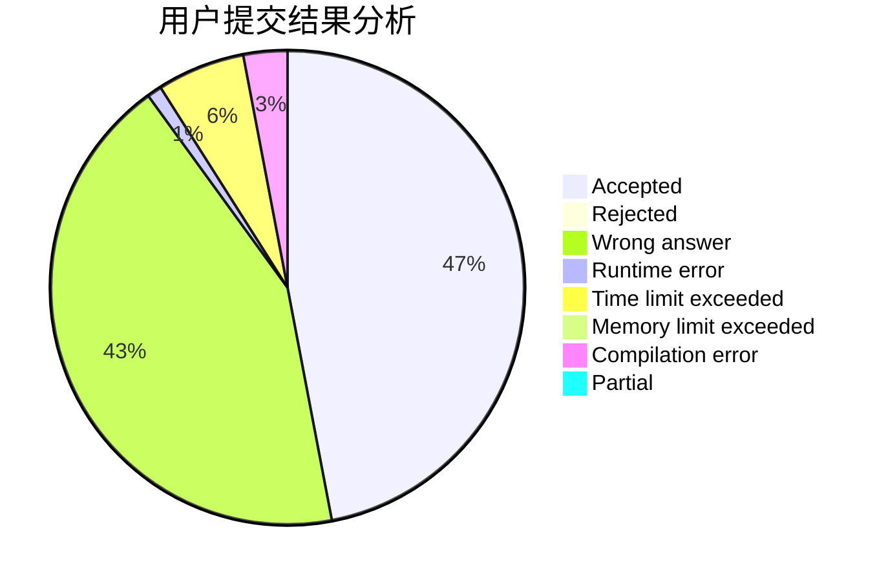
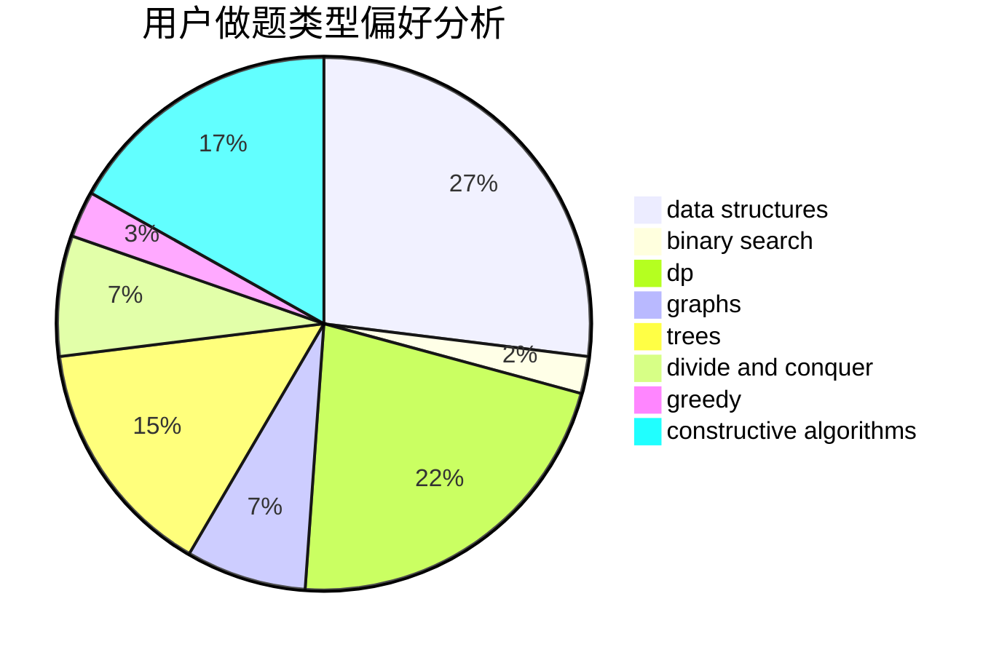
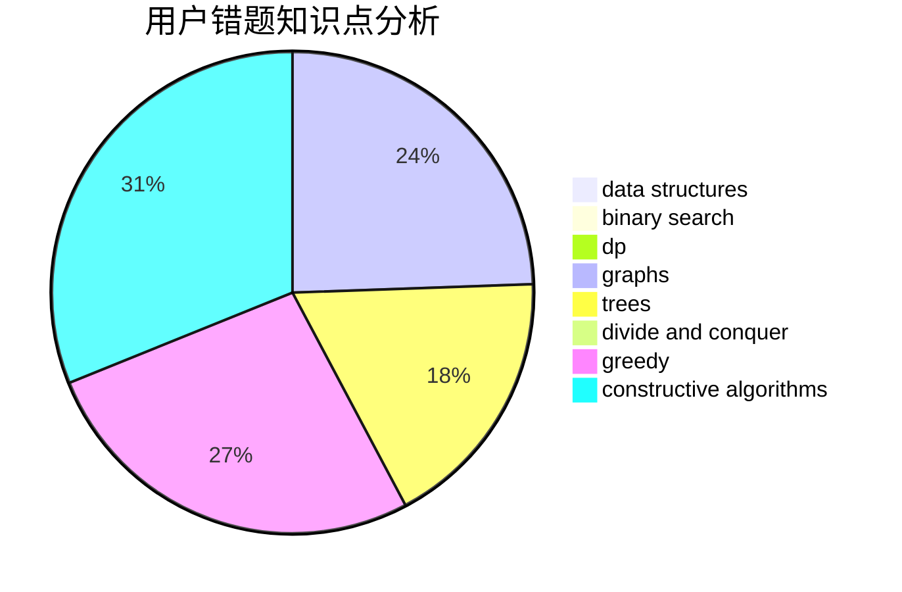

# wennitao

<!-- tabs:start -->

#### **用户提交结果分析**

#### **用户做题类型偏好分析**

#### **用户错题知识点分析**

<!-- tabs:end -->
# 推荐题目
[579A](https://codeforces.com/contest/579/problem/A)		bitmasks		  
[1166D](https://codeforces.com/contest/1166/problem/D)		binary search,
                        brute force,
                        greedy,
                        math		  
[814D](https://codeforces.com/contest/814/problem/D)		dfs and similar,
                        dp,
                        geometry,
                        greedy,
                        trees		  
[1256C](https://codeforces.com/contest/1256/problem/C)		greedy		  
[716B](https://codeforces.com/contest/716/problem/B)		greedy,
                        two pointers		  
[859E](https://codeforces.com/contest/859/problem/E)		combinatorics,
                        dfs and similar,
                        dsu,
                        graphs,
                        trees		  
[383E](https://codeforces.com/contest/383/problem/E)		combinatorics,
                        divide and conquer,
                        dp		  
[598E](https://codeforces.com/contest/598/problem/E)		brute force,
                        dp		  
[800A](https://codeforces.com/contest/800/problem/A)		dsu,graphs,sortings,trees		  
[896B](https://codeforces.com/contest/896/problem/B)		binary search,
                        constructive algorithms,
                        games,
                        greedy,
                        interactive		  
