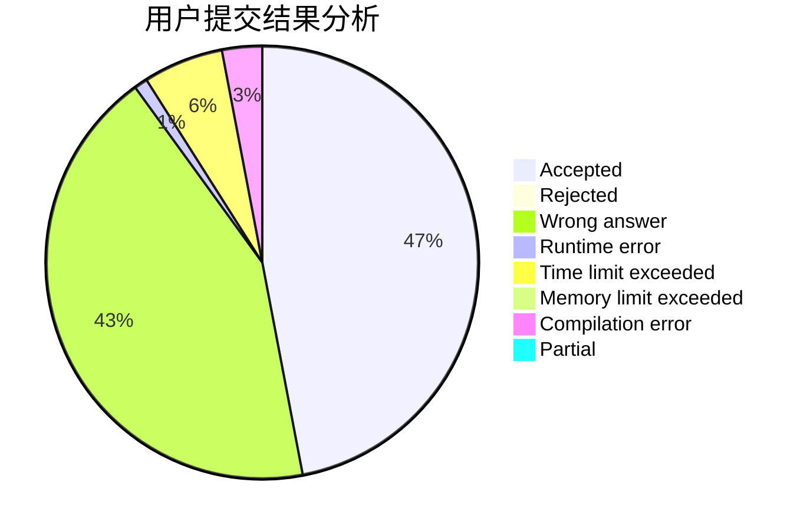
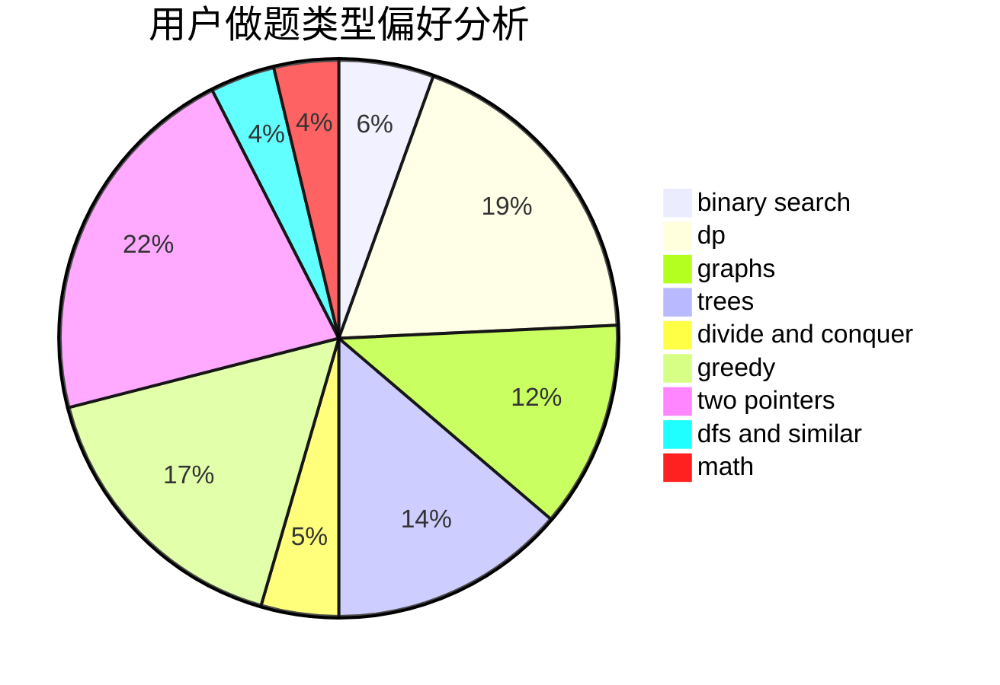

# wennitao

<!-- tabs:start -->

#### **用户提交结果分析**

#### **用户做题类型偏好分析**

<!-- tabs:end -->
# 推荐题目
[579A](https://codeforces.com/contest/579/problem/A)
[1166D](https://codeforces.com/contest/1166/problem/D)
[814D](https://codeforces.com/contest/814/problem/D)
[1256C](https://codeforces.com/contest/1256/problem/C)
[716B](https://codeforces.com/contest/716/problem/B)
[859E](https://codeforces.com/contest/859/problem/E)
[383E](https://codeforces.com/contest/383/problem/E)
[598E](https://codeforces.com/contest/598/problem/E)
[800A](https://codeforces.com/contest/800/problem/A)
[896B](https://codeforces.com/contest/896/problem/B)
