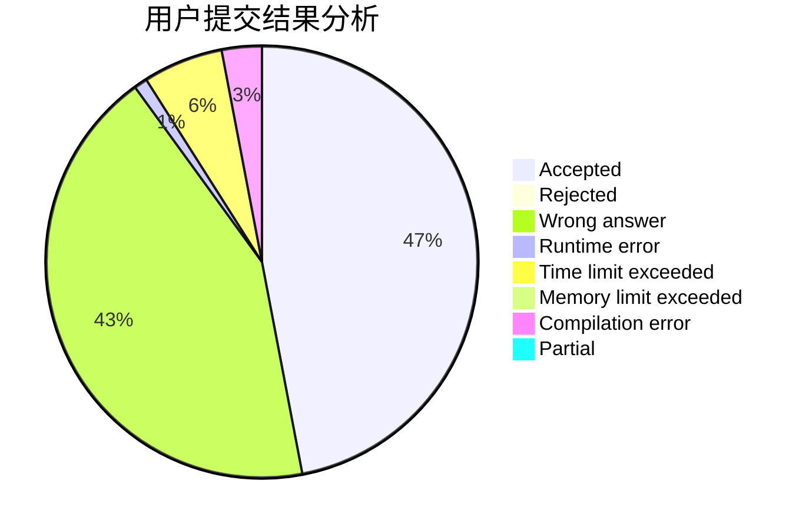
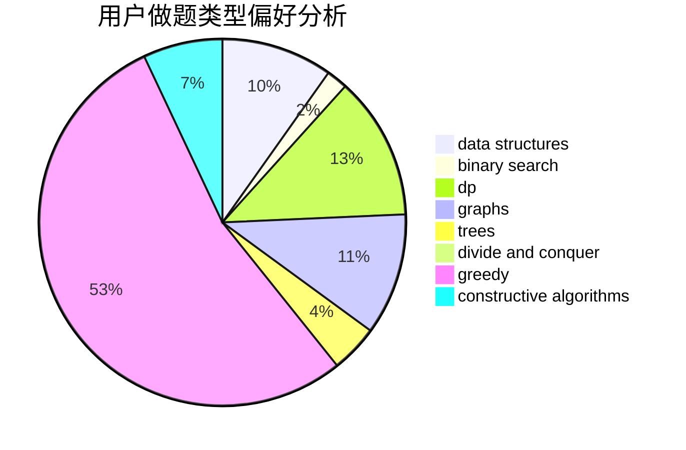
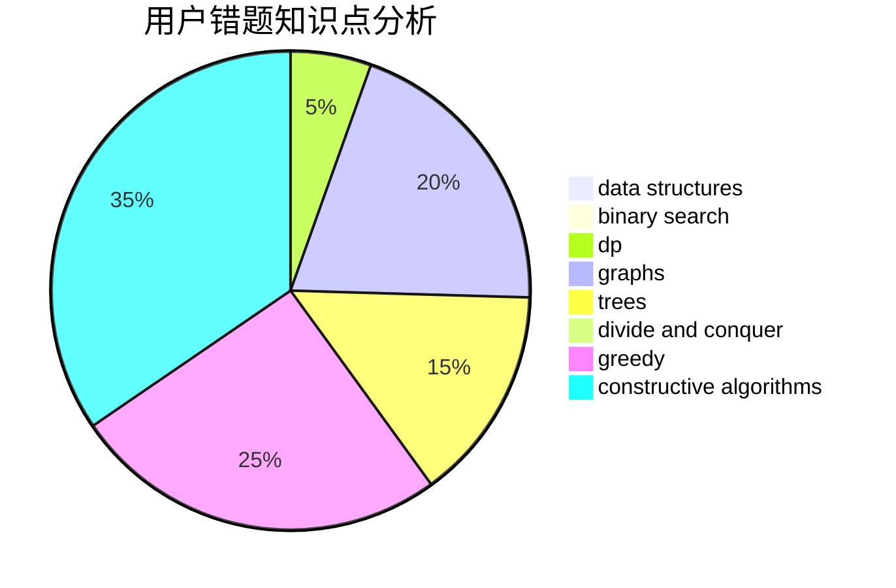

# wennitao

<!-- tabs:start -->

#### **用户提交结果分析**

#### **用户做题类型偏好分析**

#### **用户错题知识点分析**

<!-- tabs:end -->
# 推荐题目
[553E](https://codeforces.com/contest/553/problem/E)		dp,
                        fft,
                        graphs,
                        math,
                        probabilities		  
[1164M](https://codeforces.com/contest/1164/problem/M)		dsu,graphs,sortings,trees		  
[7C](https://codeforces.com/contest/7/problem/C)		math,
                        number theory		  
[1251B](https://codeforces.com/contest/1251/problem/B)		greedy,
                        strings		  
[699C](https://codeforces.com/contest/699/problem/C)		dsu,graphs,sortings,trees		  
[840A](https://codeforces.com/contest/840/problem/A)		combinatorics,
                        greedy,
                        math,
                        number theory,
                        sortings		  
[358D](https://codeforces.com/contest/358/problem/D)		dp,
                        greedy		  
[576E](https://codeforces.com/contest/576/problem/E)		binary search,
                        data structures		  
[782B](https://codeforces.com/contest/782/problem/B)		dsu,graphs,sortings,trees		  
[876A](https://codeforces.com/contest/876/problem/A)		math		  
