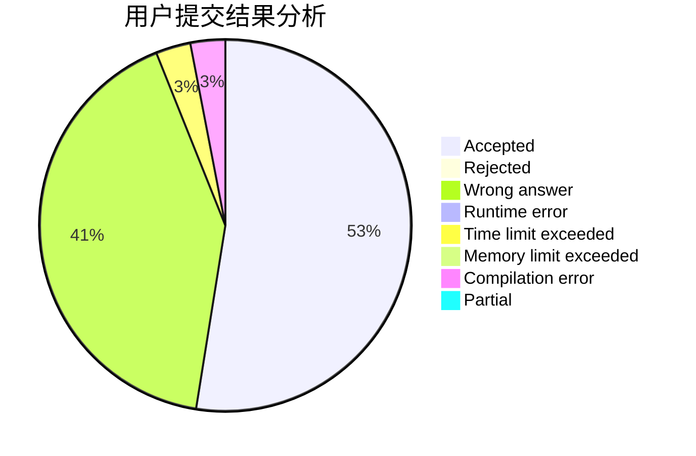
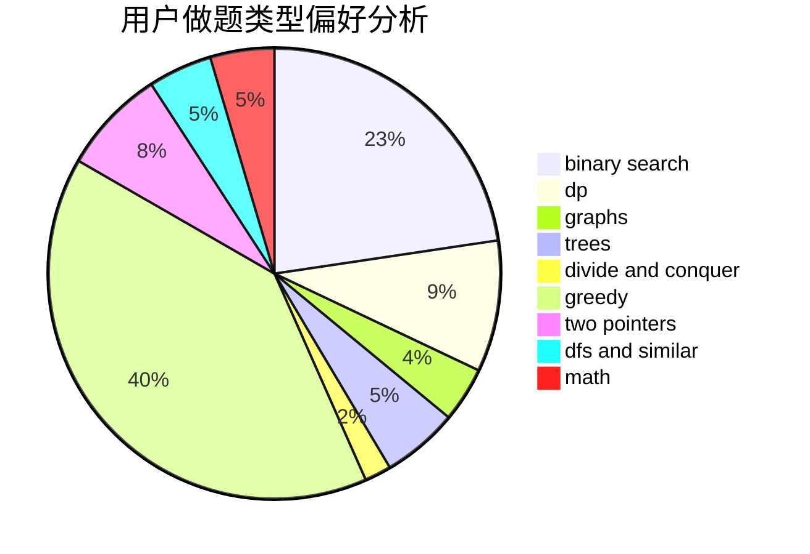

# wenzhuan

<!-- tabs:start -->

#### **用户提交结果分析**

#### **用户做题类型偏好分析**

<!-- tabs:end -->
# 推荐题目
[722D](https://codeforces.com/contest/722/problem/D)
[1033E](https://codeforces.com/contest/1033/problem/E)
[437B](https://codeforces.com/contest/437/problem/B)
[1349E](https://codeforces.com/contest/1349/problem/E)
[580B](https://codeforces.com/contest/580/problem/B)
[425E](https://codeforces.com/contest/425/problem/E)
[1093G](https://codeforces.com/contest/1093/problem/G)
[497E](https://codeforces.com/contest/497/problem/E)
[438C](https://codeforces.com/contest/438/problem/C)
[699D](https://codeforces.com/contest/699/problem/D)
