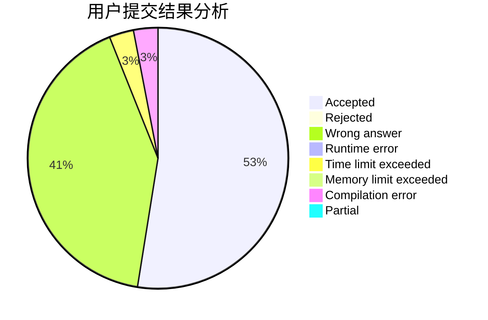
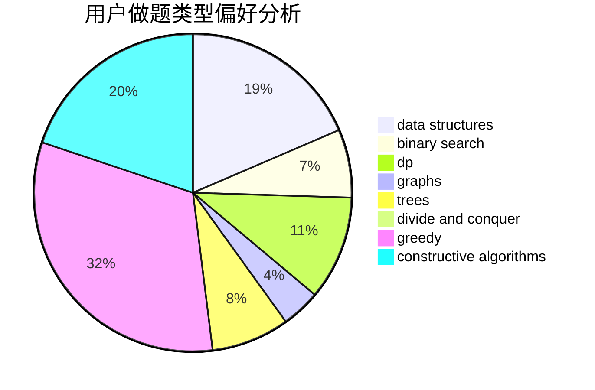
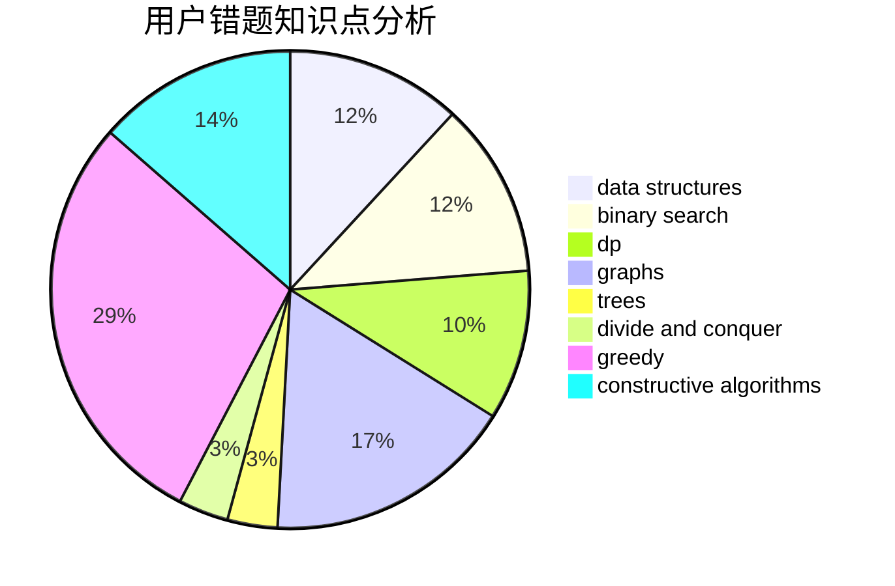

# wenzhuan

<!-- tabs:start -->

#### **用户提交结果分析**

#### **用户做题类型偏好分析**

#### **用户错题知识点分析**

<!-- tabs:end -->
# 推荐题目
[703C](https://codeforces.com/contest/703/problem/C)		geometry,
                        implementation		  
[1033B](https://codeforces.com/contest/1033/problem/B)		math,
                        number theory		  
[409H](https://codeforces.com/contest/409/problem/H)		*special problem,
                        brute force,
                        constructive algorithms,
                        dsu,
                        implementation		  
[1343A](https://codeforces.com/contest/1343/problem/A)		brute force,
                        math		  
[555E](https://codeforces.com/contest/555/problem/E)		dfs and similar,
                        graphs,
                        trees		  
[39C](https://codeforces.com/contest/39/problem/C)		dp,
                        sortings		  
[1093D](https://codeforces.com/contest/1093/problem/D)		dfs and similar,
                        graphs		  
[477E](https://codeforces.com/contest/477/problem/E)		data structures		  
[412D](https://codeforces.com/contest/412/problem/D)		dfs and similar		  
[674G](https://codeforces.com/contest/674/problem/G)		dsu,graphs,sortings,trees		  
