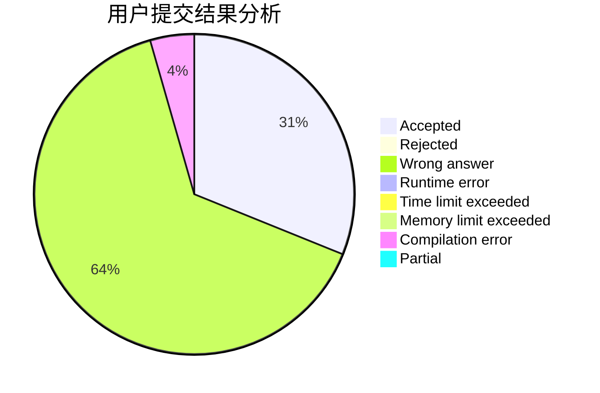
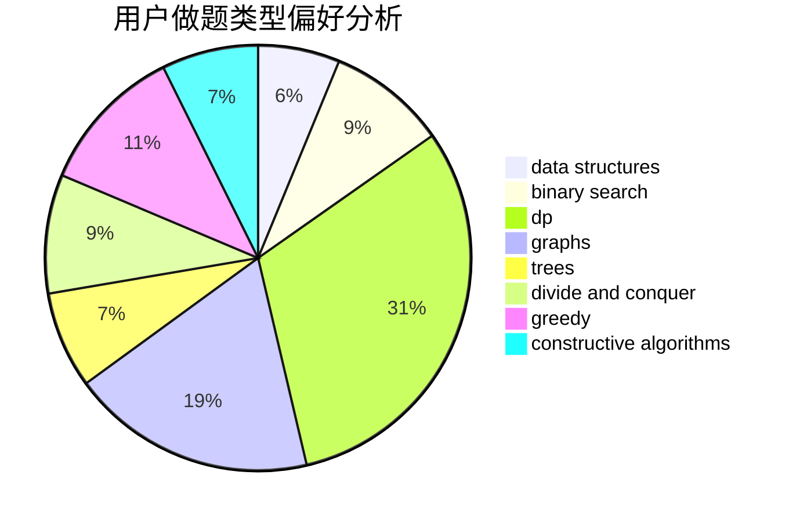

# wf1594937223

<!-- tabs:start -->

#### **用户提交结果分析**

#### **用户做题类型偏好分析**

#### **用户错题知识点分析**

<!-- tabs:end -->
# 推荐题目
[304D](https://codeforces.com/contest/304/problem/D)		dsu,graphs,sortings,trees		  
[274D](https://codeforces.com/contest/274/problem/D)		dfs and similar,
                        graphs,
                        greedy,
                        sortings		  
[682D](https://codeforces.com/contest/682/problem/D)		dp,
                        strings		  
[600C](https://codeforces.com/contest/600/problem/C)		constructive algorithms,
                        greedy,
                        strings		  
[793G](https://codeforces.com/contest/793/problem/G)		data structures,
                        divide and conquer,
                        flows,
                        graph matchings		  
[967E](https://codeforces.com/contest/967/problem/E)		dsu,graphs,sortings,trees		  
[960A](https://codeforces.com/contest/960/problem/A)		implementation		  
[10151](https://codeforces.com/contest/1015/problem/1)		dsu,graphs,sortings,trees		  
[1106A](https://codeforces.com/contest/1106/problem/A)		implementation		  
[856E](https://codeforces.com/contest/856/problem/E)		nan		  
