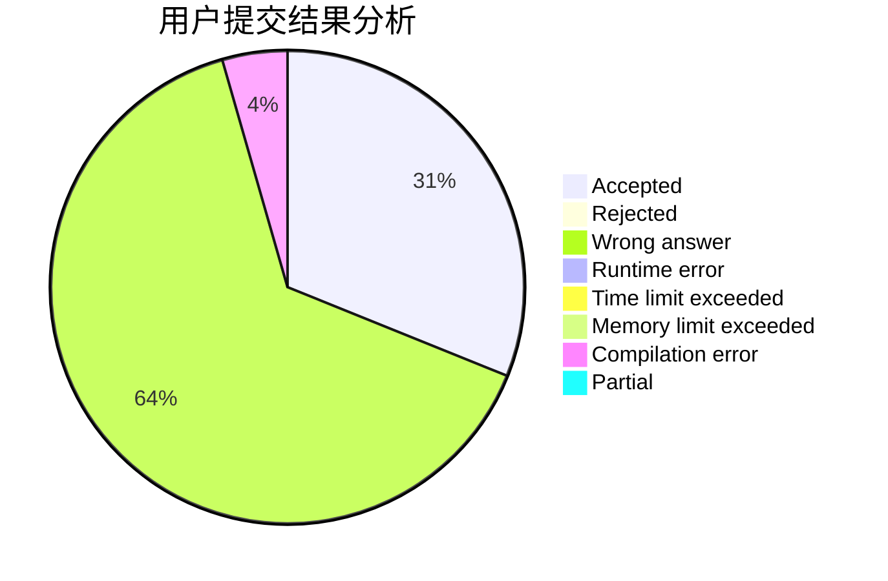
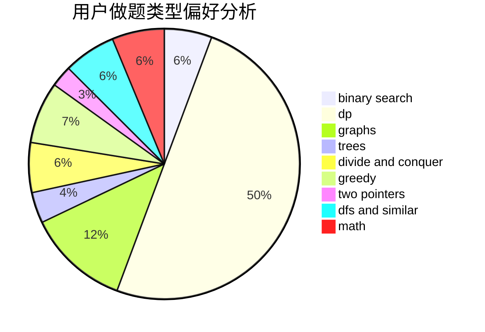

# wf1594937223

<!-- tabs:start -->

#### **用户提交结果分析**

#### **用户做题类型偏好分析**

<!-- tabs:end -->
# 推荐题目
[304D](https://codeforces.com/contest/304/problem/D)
[274D](https://codeforces.com/contest/274/problem/D)
[682D](https://codeforces.com/contest/682/problem/D)
[600C](https://codeforces.com/contest/600/problem/C)
[793G](https://codeforces.com/contest/793/problem/G)
[967E](https://codeforces.com/contest/967/problem/E)
[960A](https://codeforces.com/contest/960/problem/A)
[10151](https://codeforces.com/contest/1015/problem/1)
[1106A](https://codeforces.com/contest/1106/problem/A)
[856E](https://codeforces.com/contest/856/problem/E)
