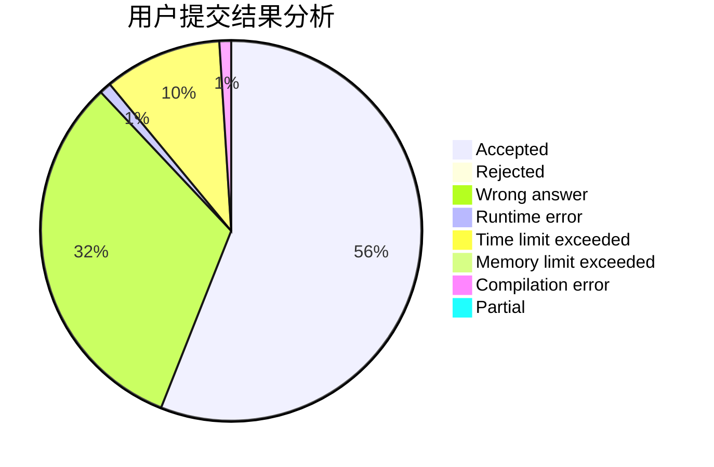
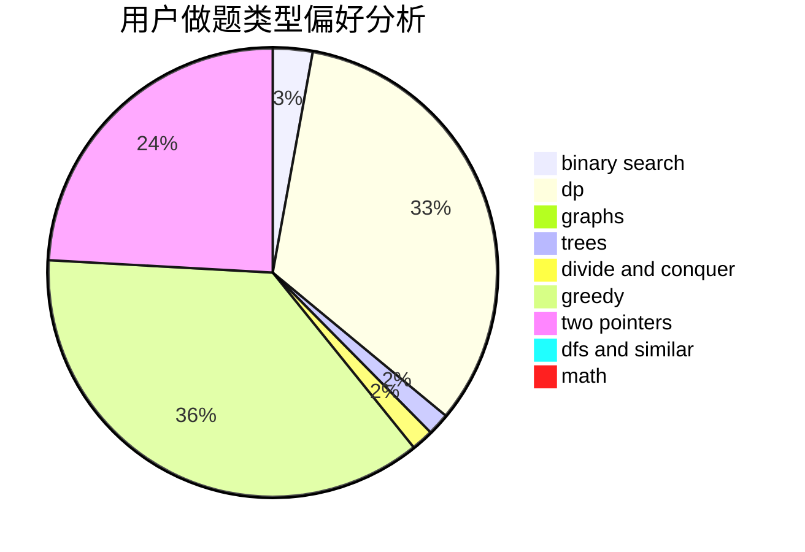

# wgx666

<!-- tabs:start -->

#### **用户提交结果分析**

#### **用户做题类型偏好分析**

<!-- tabs:end -->
# 推荐题目
[967B](https://codeforces.com/contest/967/problem/B)
[653D](https://codeforces.com/contest/653/problem/D)
[954C](https://codeforces.com/contest/954/problem/C)
[13572](https://codeforces.com/contest/1357/problem/2)
[27C](https://codeforces.com/contest/27/problem/C)
[173B](https://codeforces.com/contest/173/problem/B)
[1030D](https://codeforces.com/contest/1030/problem/D)
[1331G](https://codeforces.com/contest/1331/problem/G)
[998C](https://codeforces.com/contest/998/problem/C)
[195B](https://codeforces.com/contest/195/problem/B)
