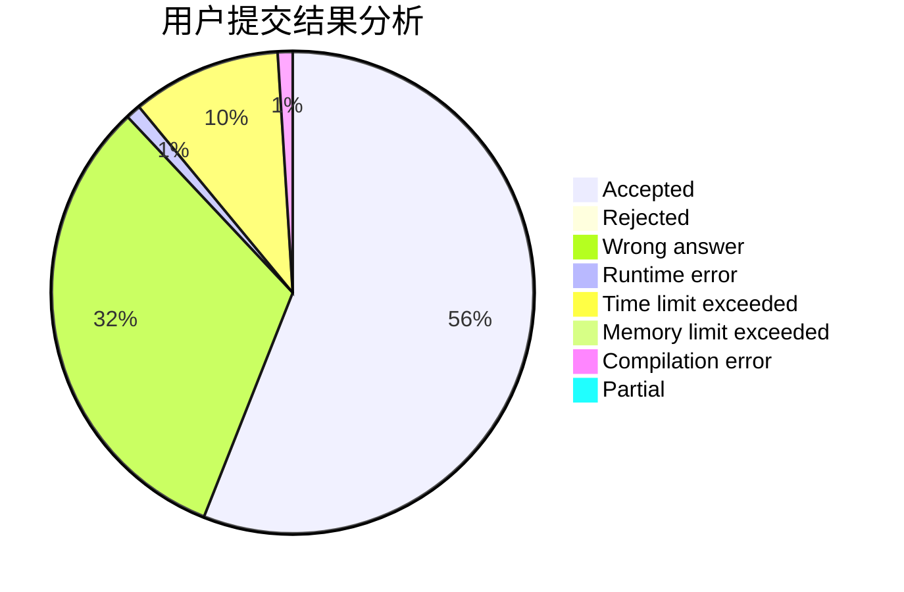
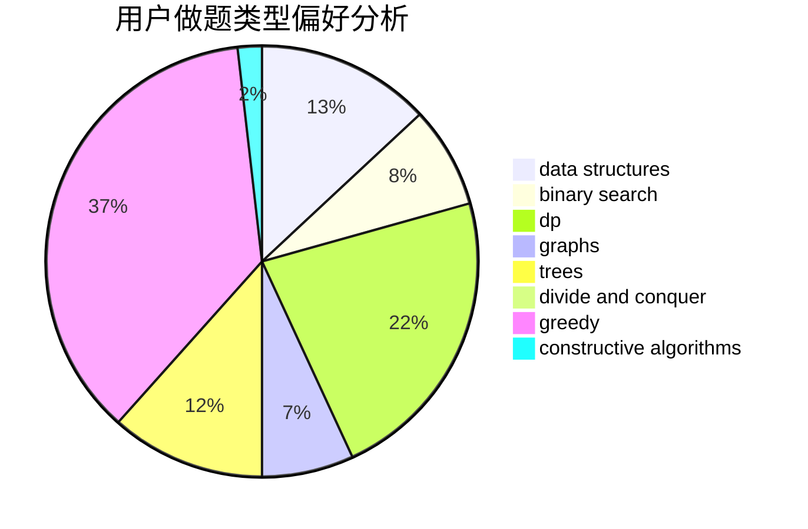
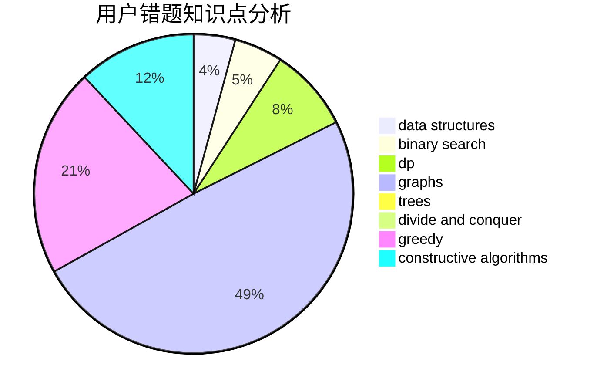

# wgx666

<!-- tabs:start -->

#### **用户提交结果分析**

#### **用户做题类型偏好分析**

#### **用户错题知识点分析**

<!-- tabs:end -->
# 推荐题目
[94C](https://codeforces.com/contest/94/problem/C)		dsu,graphs,sortings,trees		  
[627D](https://codeforces.com/contest/627/problem/D)		binary search,
                        dfs and similar,
                        dp,
                        graphs,
                        greedy,
                        trees		  
[932C](https://codeforces.com/contest/932/problem/C)		brute force,
                        constructive algorithms		  
[1349F2](https://codeforces.com/contest/1349F/problem/2)		dp,
                        fft,
                        math		  
[261E](https://codeforces.com/contest/261/problem/E)		brute force,
                        dp,
                        two pointers		  
[1513D](https://codeforces.com/contest/1513/problem/D)		constructive algorithms,
                        dsu,
                        graphs,
                        greedy,
                        number theory,
                        sortings		  
[1030A](https://codeforces.com/contest/1030/problem/A)		implementation		  
[1325C](https://codeforces.com/contest/1325/problem/C)		constructive algorithms,
                        dfs and similar,
                        greedy,
                        trees		  
[982E](https://codeforces.com/contest/982/problem/E)		geometry,
                        number theory		  
[16A](https://codeforces.com/contest/16/problem/A)		implementation		  
