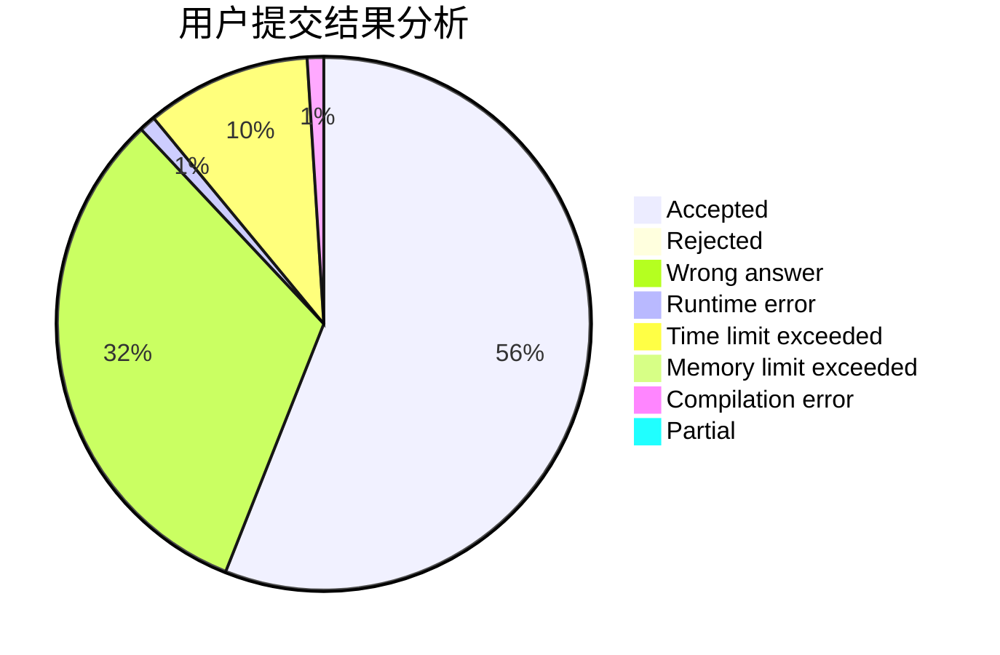
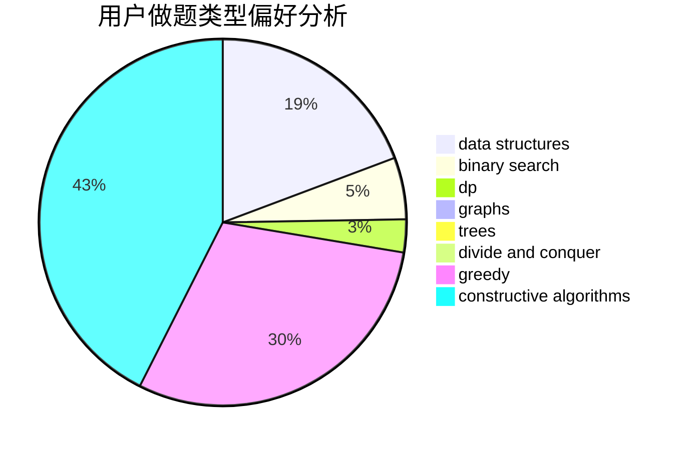
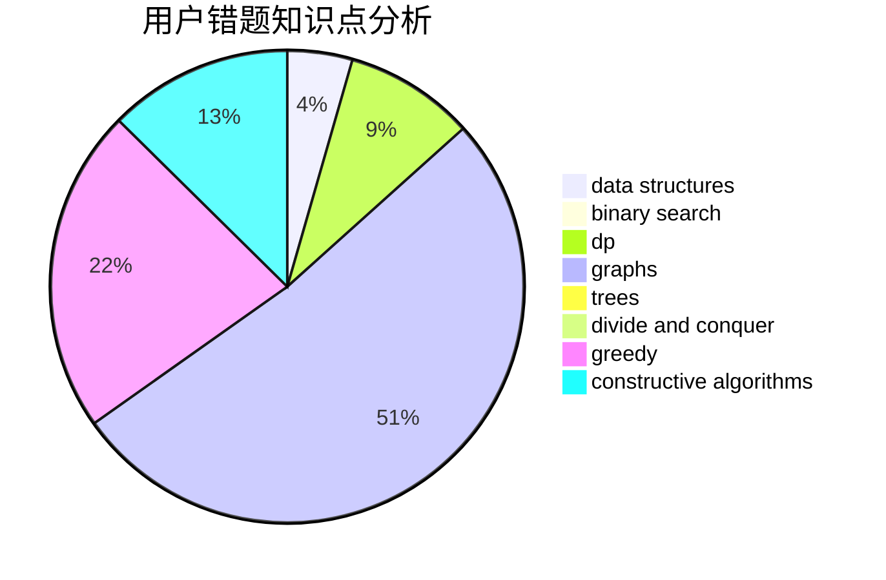

# wgx666

<!-- tabs:start -->

#### **用户提交结果分析**

#### **用户做题类型偏好分析**

#### **用户错题知识点分析**

<!-- tabs:end -->
# 推荐题目
[967B](https://codeforces.com/contest/967/problem/B)		math,
                        sortings		  
[653D](https://codeforces.com/contest/653/problem/D)		binary search,
                        flows,
                        graphs		  
[954C](https://codeforces.com/contest/954/problem/C)		implementation		  
[13572](https://codeforces.com/contest/1357/problem/2)		dsu,graphs,sortings,trees		  
[27C](https://codeforces.com/contest/27/problem/C)		constructive algorithms,
                        greedy		  
[173B](https://codeforces.com/contest/173/problem/B)		dfs and similar,
                        shortest paths		  
[1030D](https://codeforces.com/contest/1030/problem/D)		geometry,
                        number theory		  
[1331G](https://codeforces.com/contest/1331/problem/G)		nan		  
[998C](https://codeforces.com/contest/998/problem/C)		dsu,graphs,sortings,trees		  
[195B](https://codeforces.com/contest/195/problem/B)		data structures,
                        implementation,
                        math		  
