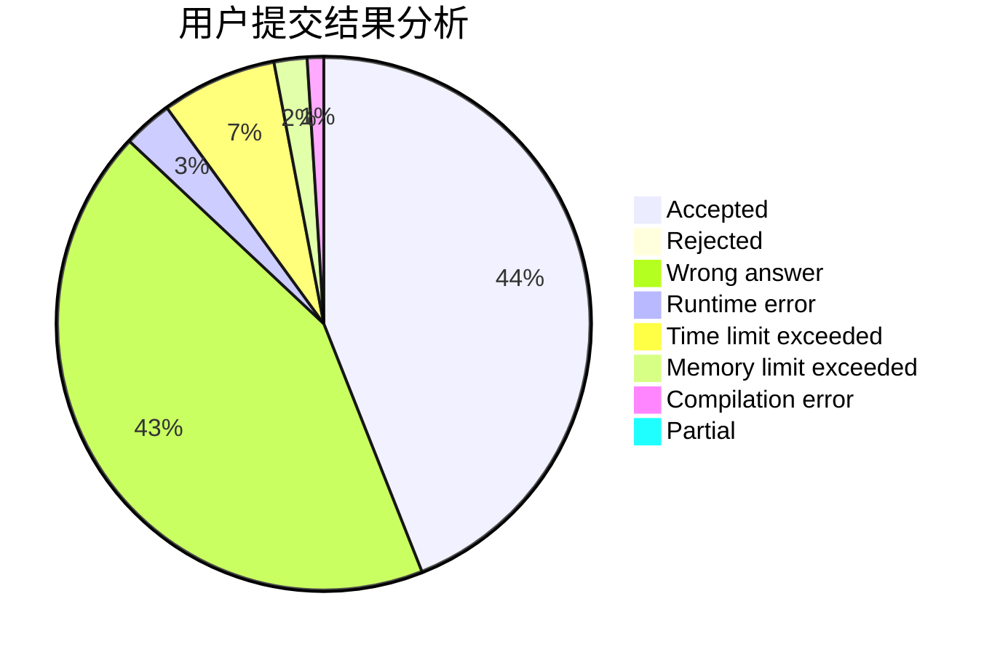
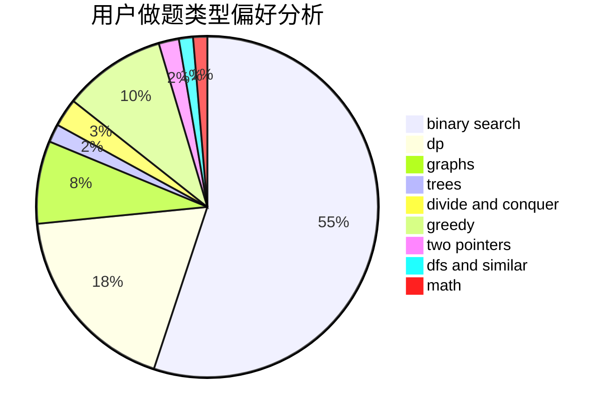

# wh0816

<!-- tabs:start -->

#### **用户提交结果分析**

#### **用户做题类型偏好分析**

<!-- tabs:end -->
# 推荐题目
[346B](https://codeforces.com/contest/346/problem/B)
[429D](https://codeforces.com/contest/429/problem/D)
[956D](https://codeforces.com/contest/956/problem/D)
[59E](https://codeforces.com/contest/59/problem/E)
[420C](https://codeforces.com/contest/420/problem/C)
[909A](https://codeforces.com/contest/909/problem/A)
[1056G](https://codeforces.com/contest/1056/problem/G)
[1178H](https://codeforces.com/contest/1178/problem/H)
[543B](https://codeforces.com/contest/543/problem/B)
[1084B](https://codeforces.com/contest/1084/problem/B)
