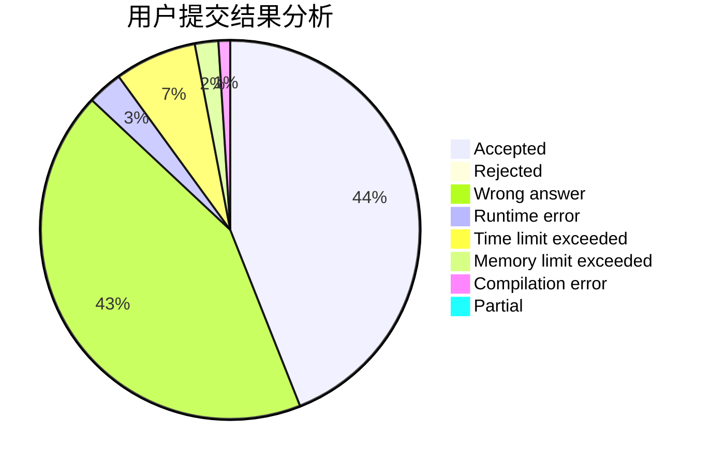
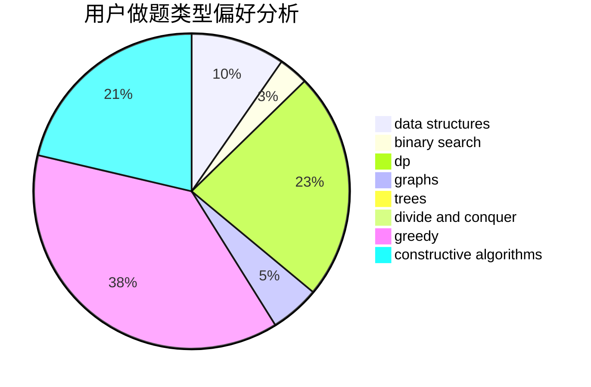
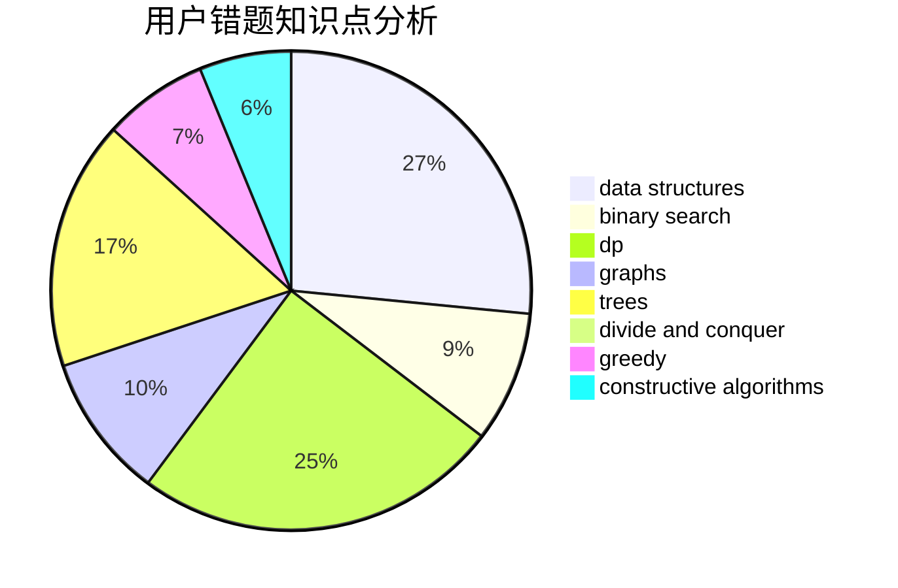

# wh0816

<!-- tabs:start -->

#### **用户提交结果分析**

#### **用户做题类型偏好分析**

#### **用户错题知识点分析**

<!-- tabs:end -->
# 推荐题目
[317A](https://codeforces.com/contest/317/problem/A)		brute force		  
[3C](https://codeforces.com/contest/3/problem/C)		brute force,
                        games,
                        implementation		  
[934E](https://codeforces.com/contest/934/problem/E)		dsu,graphs,sortings,trees		  
[578F](https://codeforces.com/contest/578/problem/F)		matrices,
                        trees		  
[391E2](https://codeforces.com/contest/391E/problem/2)		nan		  
[88A](https://codeforces.com/contest/88/problem/A)		brute force,
                        implementation		  
[1056D](https://codeforces.com/contest/1056/problem/D)		constructive algorithms,
                        dfs and similar,
                        dp,
                        graphs,
                        greedy,
                        sortings,
                        trees		  
[1175F](https://codeforces.com/contest/1175/problem/F)		brute force,
                        data structures,
                        divide and conquer,
                        hashing,
                        math		  
[516B](https://codeforces.com/contest/516/problem/B)		dsu,graphs,sortings,trees		  
[1083D](https://codeforces.com/contest/1083/problem/D)		data structures,
                        implementation		  
