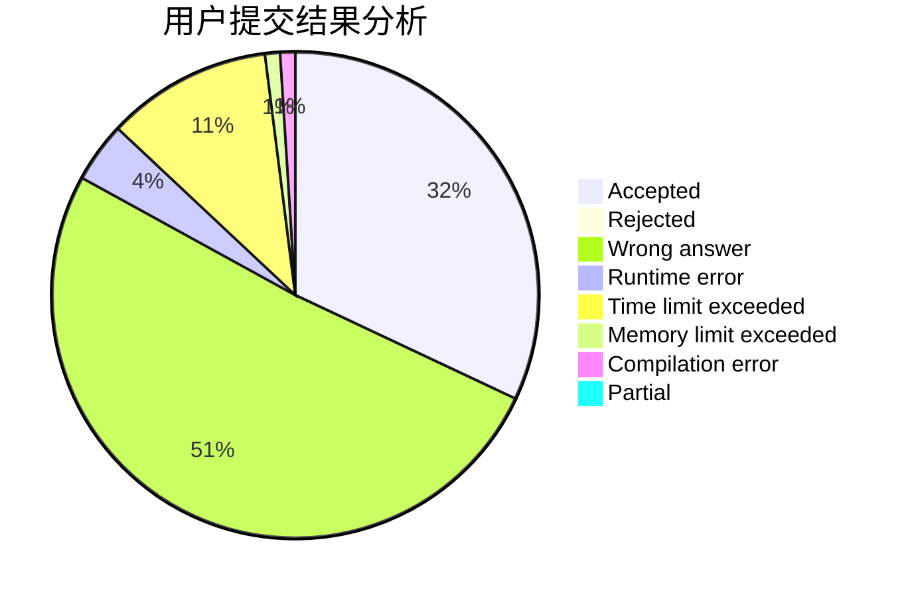
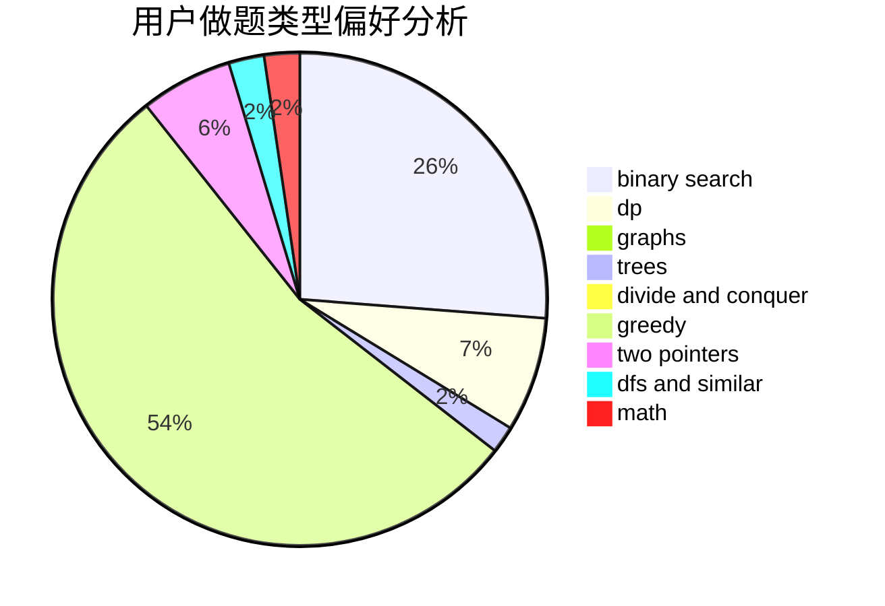

# wh2005

<!-- tabs:start -->

#### **用户提交结果分析**

#### **用户做题类型偏好分析**

<!-- tabs:end -->
# 推荐题目
[282C](https://codeforces.com/contest/282/problem/C)
[42C](https://codeforces.com/contest/42/problem/C)
[304C](https://codeforces.com/contest/304/problem/C)
[540B](https://codeforces.com/contest/540/problem/B)
[832C](https://codeforces.com/contest/832/problem/C)
[103C](https://codeforces.com/contest/103/problem/C)
[1076F](https://codeforces.com/contest/1076/problem/F)
[764E](https://codeforces.com/contest/764/problem/E)
[1143A](https://codeforces.com/contest/1143/problem/A)
[1501E](https://codeforces.com/contest/1501/problem/E)
