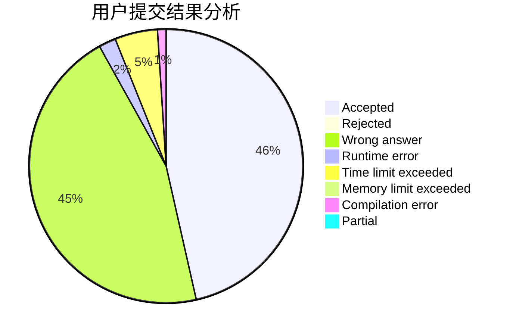
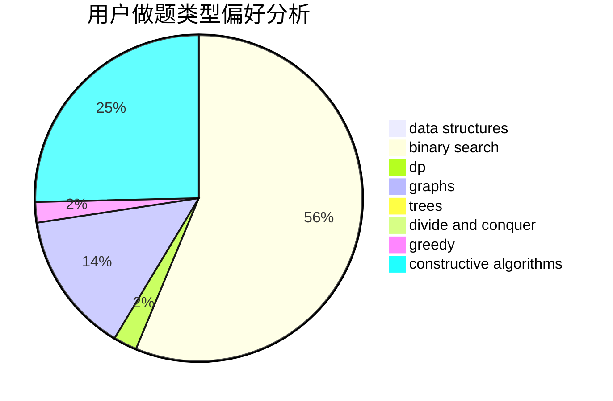

# whd

<!-- tabs:start -->

#### **用户提交结果分析**

#### **用户做题类型偏好分析**

#### **用户错题知识点分析**

<!-- tabs:end -->
# 推荐题目
[1364D](https://codeforces.com/contest/1364/problem/D)		constructive algorithms,
                        dfs and similar,
                        graphs,
                        greedy,
                        implementation,
                        trees		  
[286A](https://codeforces.com/contest/286/problem/A)		constructive algorithms,
                        math		  
[1215B](https://codeforces.com/contest/1215/problem/B)		combinatorics,
                        dp,
                        implementation		  
[548B](https://codeforces.com/contest/548/problem/B)		brute force,
                        dp,
                        greedy,
                        implementation		  
[676D](https://codeforces.com/contest/676/problem/D)		graphs,
                        implementation,
                        shortest paths		  
[38C](https://codeforces.com/contest/38/problem/C)		brute force		  
[605C](https://codeforces.com/contest/605/problem/C)		geometry		  
[1446C](https://codeforces.com/contest/1446/problem/C)		binary search,
                        bitmasks,
                        data structures,
                        divide and conquer,
                        dp,
                        trees		  
[253D](https://codeforces.com/contest/253/problem/D)		brute force,
                        two pointers		  
[1423N](https://codeforces.com/contest/1423/problem/N)		nan		  
