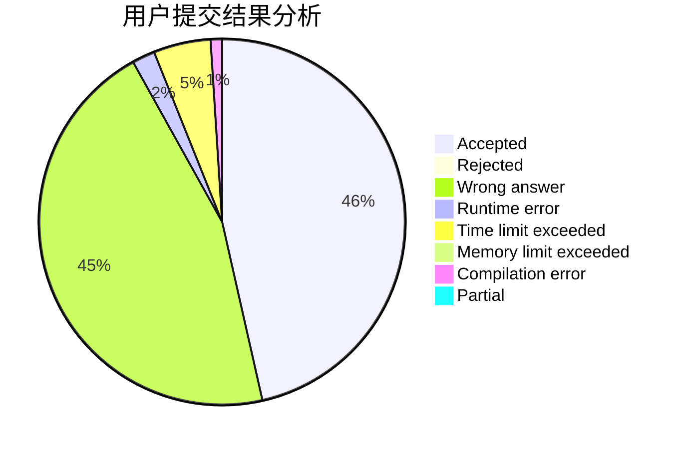
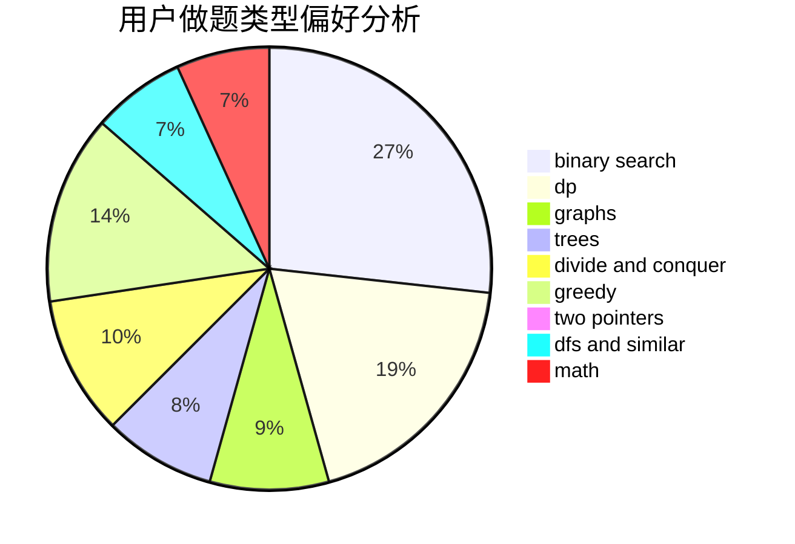

# whd

<!-- tabs:start -->

#### **用户提交结果分析**

#### **用户做题类型偏好分析**

<!-- tabs:end -->
# 推荐题目
[1364D](https://codeforces.com/contest/1364/problem/D)
[286A](https://codeforces.com/contest/286/problem/A)
[1215B](https://codeforces.com/contest/1215/problem/B)
[548B](https://codeforces.com/contest/548/problem/B)
[676D](https://codeforces.com/contest/676/problem/D)
[38C](https://codeforces.com/contest/38/problem/C)
[605C](https://codeforces.com/contest/605/problem/C)
[1446C](https://codeforces.com/contest/1446/problem/C)
[253D](https://codeforces.com/contest/253/problem/D)
[1423N](https://codeforces.com/contest/1423/problem/N)
