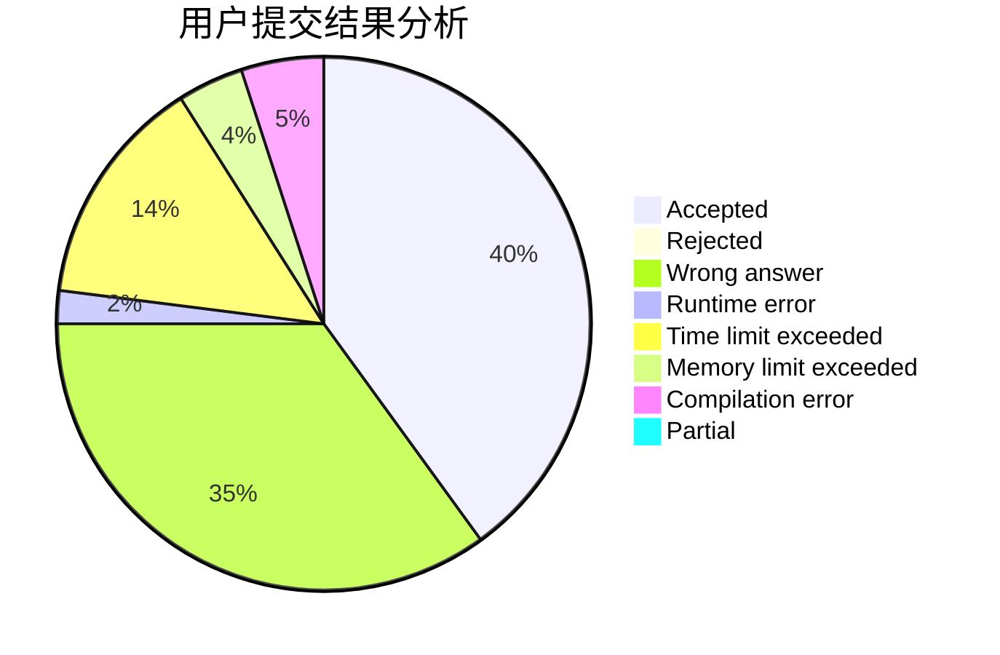
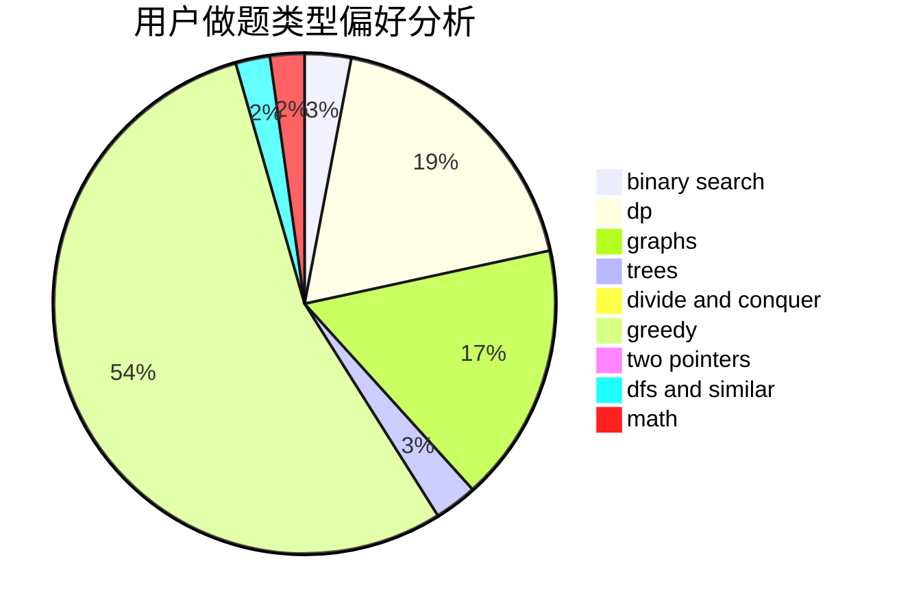

# whx1003

<!-- tabs:start -->

#### **用户提交结果分析**

#### **用户做题类型偏好分析**

<!-- tabs:end -->
# 推荐题目
[581B](https://codeforces.com/contest/581/problem/B)
[660B](https://codeforces.com/contest/660/problem/B)
[1140D](https://codeforces.com/contest/1140/problem/D)
[528C](https://codeforces.com/contest/528/problem/C)
[1202D](https://codeforces.com/contest/1202/problem/D)
[1321C](https://codeforces.com/contest/1321/problem/C)
[13783](https://codeforces.com/contest/1378/problem/3)
[729C](https://codeforces.com/contest/729/problem/C)
[1245D](https://codeforces.com/contest/1245/problem/D)
[1078E](https://codeforces.com/contest/1078/problem/E)
