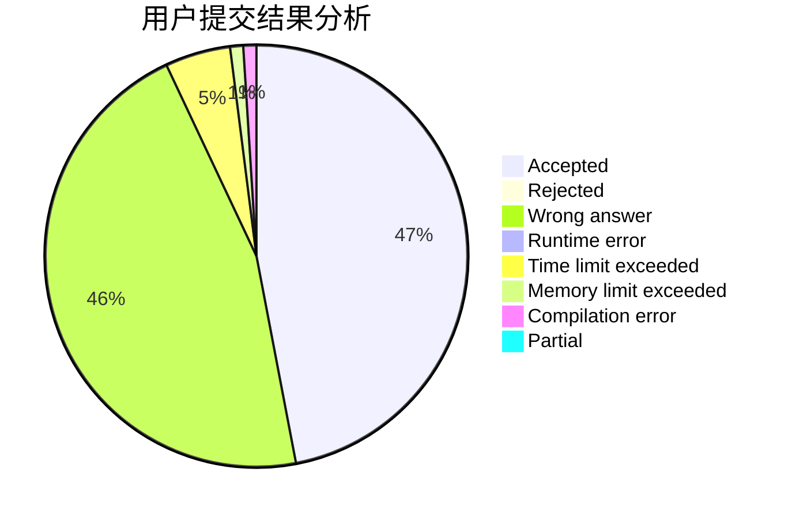
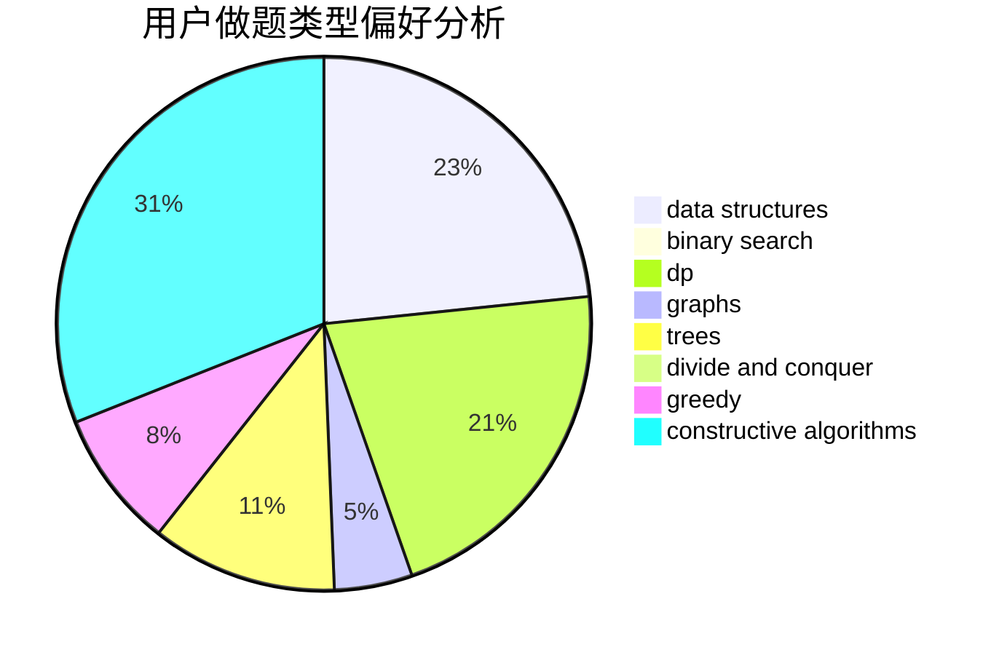
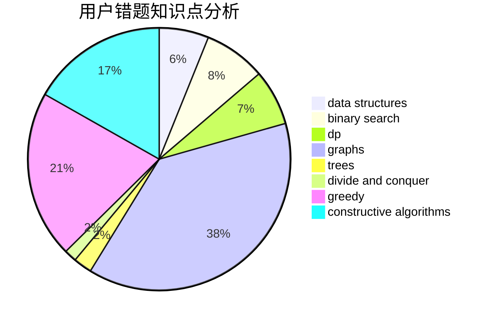

# whywyh

<!-- tabs:start -->

#### **用户提交结果分析**

#### **用户做题类型偏好分析**

#### **用户错题知识点分析**

<!-- tabs:end -->
# 推荐题目
[1393E2](https://codeforces.com/contest/1393E/problem/2)		dp,
                        hashing,
                        implementation,
                        string suffix structures,
                        strings,
                        two pointers		  
[931D](https://codeforces.com/contest/931/problem/D)		dsu,graphs,sortings,trees		  
[1349F1](https://codeforces.com/contest/1349F/problem/1)		dp,
                        fft,
                        math		  
[317A](https://codeforces.com/contest/317/problem/A)		brute force		  
[570D](https://codeforces.com/contest/570/problem/D)		binary search,
                        bitmasks,
                        constructive algorithms,
                        dfs and similar,
                        graphs,
                        trees		  
[780B](https://codeforces.com/contest/780/problem/B)		binary search		  
[1199B](https://codeforces.com/contest/1199/problem/B)		geometry,
                        math		  
[1119G](https://codeforces.com/contest/1119/problem/G)		constructive algorithms,
                        implementation		  
[1004F](https://codeforces.com/contest/1004/problem/F)		bitmasks,
                        data structures,
                        divide and conquer		  
[675D](https://codeforces.com/contest/675/problem/D)		data structures,
                        trees		  
