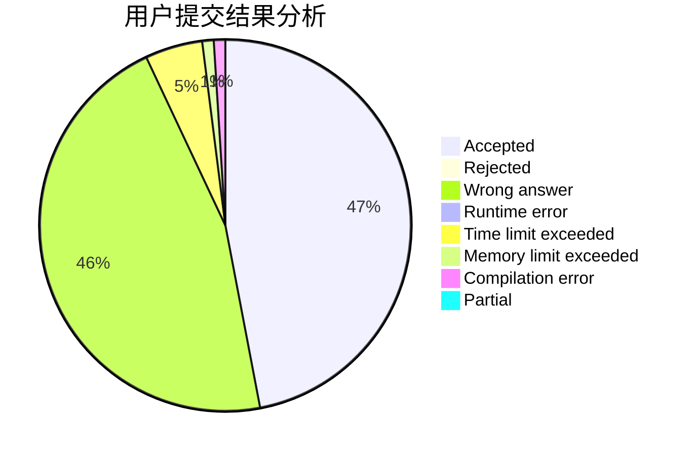
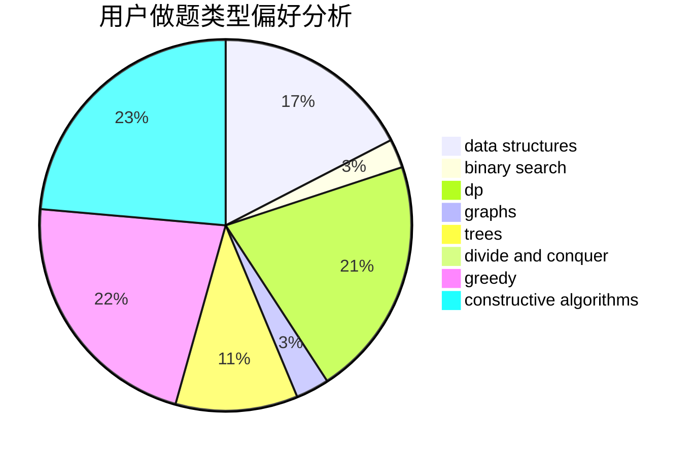
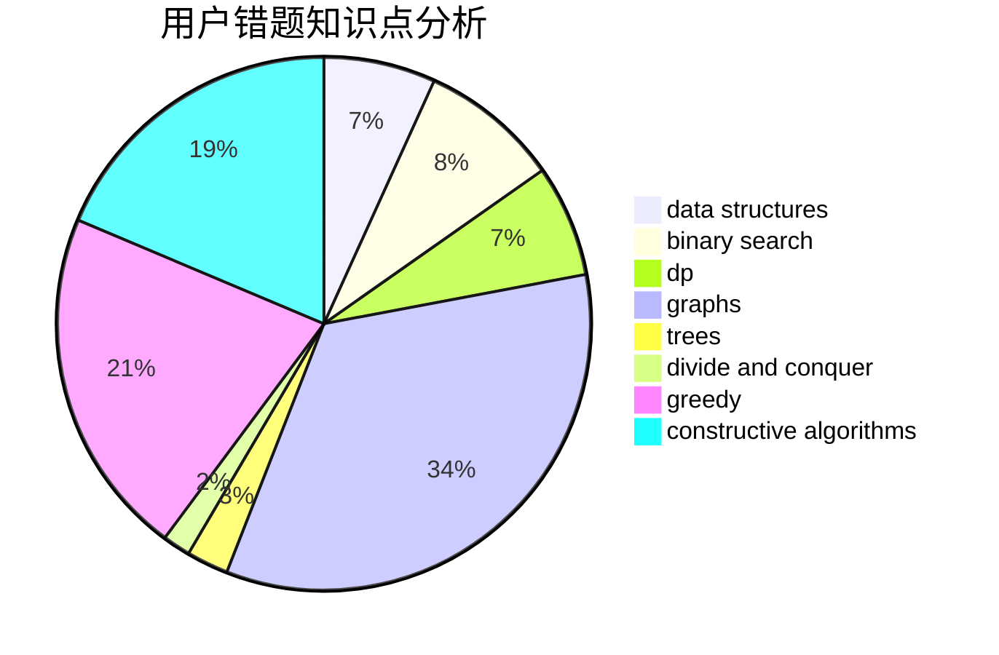

# whywyh

<!-- tabs:start -->

#### **用户提交结果分析**

#### **用户做题类型偏好分析**

#### **用户错题知识点分析**

<!-- tabs:end -->
# 推荐题目
[1401E](https://codeforces.com/contest/1401/problem/E)		data structures,
                        geometry,
                        implementation,
                        sortings		  
[952D](https://codeforces.com/contest/952/problem/D)		probabilities		  
[13571](https://codeforces.com/contest/1357/problem/1)		dsu,graphs,sortings,trees		  
[346B](https://codeforces.com/contest/346/problem/B)		dp,
                        strings		  
[591A](https://codeforces.com/contest/591/problem/A)		implementation,
                        math		  
[798E](https://codeforces.com/contest/798/problem/E)		constructive algorithms,
                        data structures,
                        graphs,
                        sortings		  
[1202F](https://codeforces.com/contest/1202/problem/F)		binary search,
                        implementation,
                        math		  
[1129C](https://codeforces.com/contest/1129/problem/C)		binary search,
                        data structures,
                        dp,
                        hashing,
                        sortings,
                        string suffix structures,
                        strings		  
[1005A](https://codeforces.com/contest/1005/problem/A)		implementation		  
[6C](https://codeforces.com/contest/6/problem/C)		greedy,
                        two pointers		  
