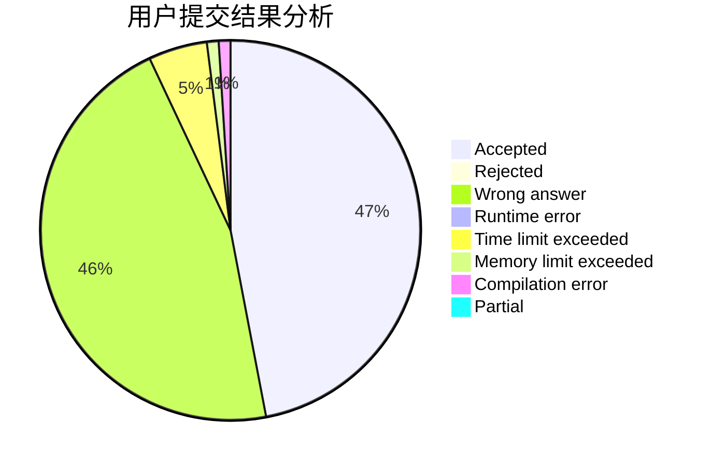
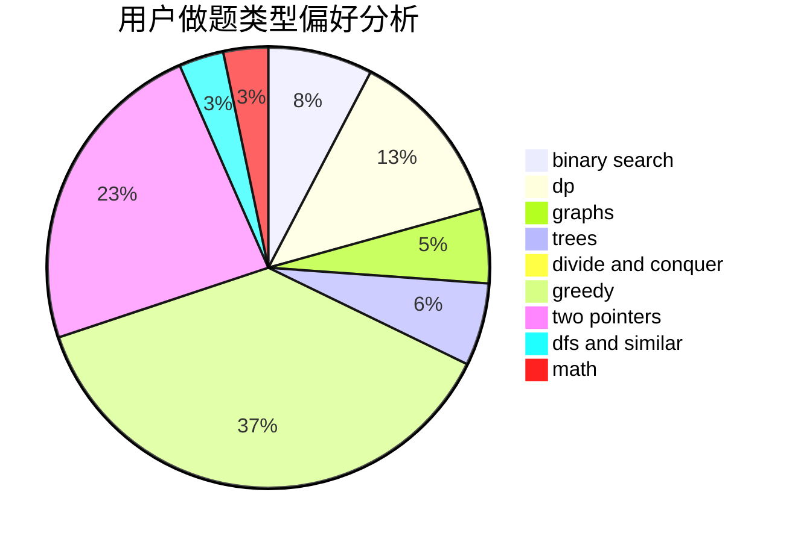

# whywyh

<!-- tabs:start -->

#### **用户提交结果分析**

#### **用户做题类型偏好分析**

<!-- tabs:end -->
# 推荐题目
[1401E](https://codeforces.com/contest/1401/problem/E)
[952D](https://codeforces.com/contest/952/problem/D)
[13571](https://codeforces.com/contest/1357/problem/1)
[346B](https://codeforces.com/contest/346/problem/B)
[591A](https://codeforces.com/contest/591/problem/A)
[798E](https://codeforces.com/contest/798/problem/E)
[1202F](https://codeforces.com/contest/1202/problem/F)
[1129C](https://codeforces.com/contest/1129/problem/C)
[1005A](https://codeforces.com/contest/1005/problem/A)
[6C](https://codeforces.com/contest/6/problem/C)
