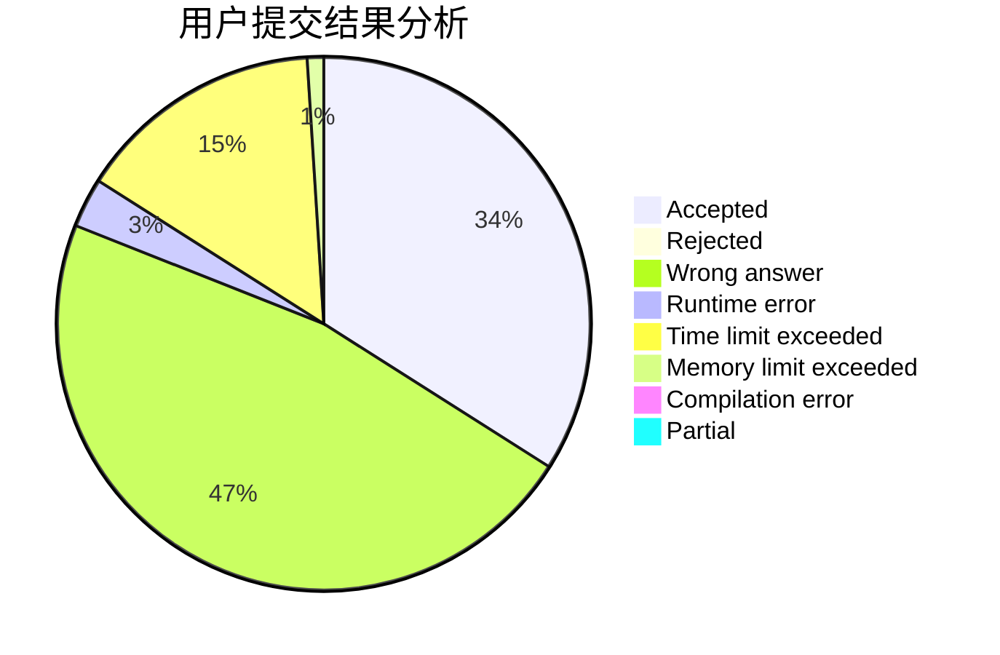
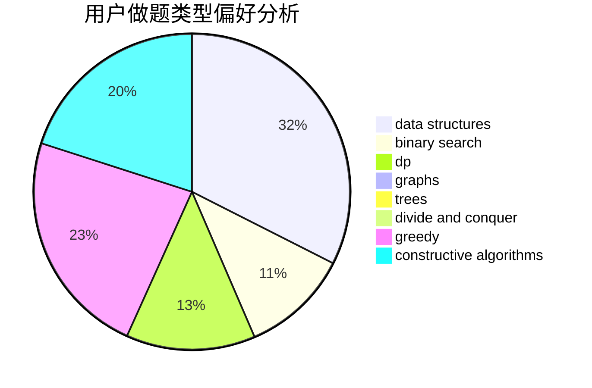
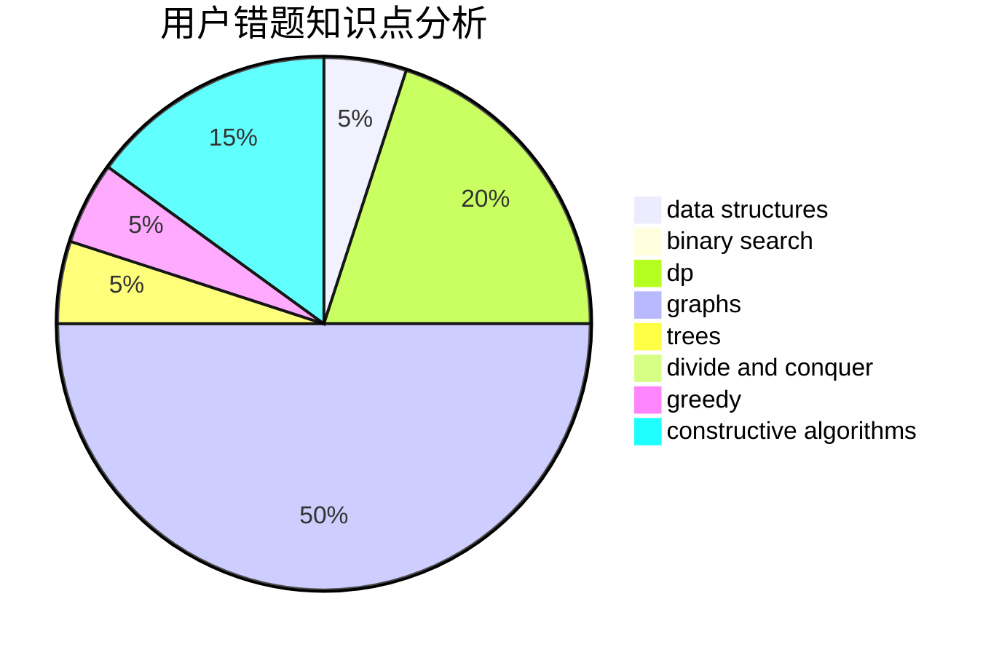

# CallmeChallenger

<!-- tabs:start -->

#### **用户提交结果分析**

#### **用户做题类型偏好分析**

#### **用户错题知识点分析**

<!-- tabs:end -->
# 推荐题目
[1278A](https://codeforces.com/contest/1278/problem/A)		brute force,
                        implementation,
                        strings		  
[1492B](https://codeforces.com/contest/1492/problem/B)		data structures,
                        greedy,
                        math		  
[62A](https://codeforces.com/contest/62/problem/A)		greedy,
                        math		  
[629E](https://codeforces.com/contest/629/problem/E)		combinatorics,
                        data structures,
                        dfs and similar,
                        dp,
                        probabilities,
                        trees		  
[2B](https://codeforces.com/contest/2/problem/B)		dp,
                        math		  
[629D](https://codeforces.com/contest/629/problem/D)		data structures,
                        dp		  
[496A](https://codeforces.com/contest/496/problem/A)		brute force,
                        implementation,
                        math		  
[1333F](https://codeforces.com/contest/1333/problem/F)		greedy,
                        implementation,
                        math,
                        number theory,
                        sortings,
                        two pointers		  
[630F](https://codeforces.com/contest/630/problem/F)		combinatorics,
                        math		  
[62E](https://codeforces.com/contest/62/problem/E)		dp,
                        flows		  
