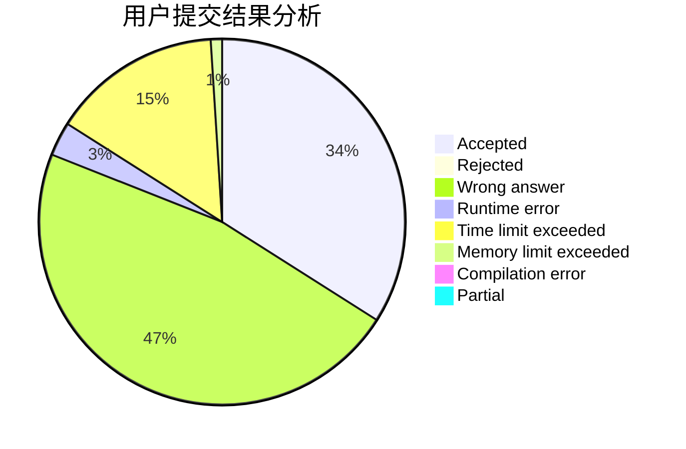
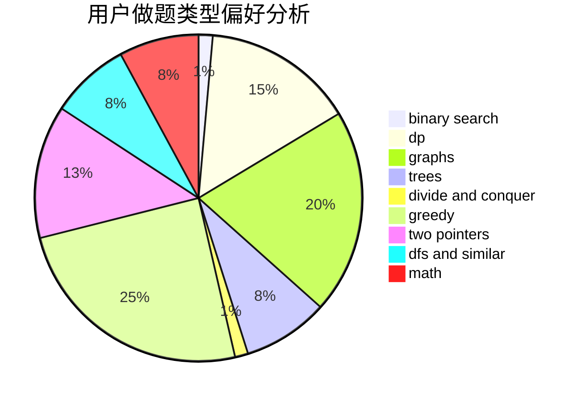

# CallmeChallenger

<!-- tabs:start -->

#### **用户提交结果分析**

#### **用户做题类型偏好分析**

<!-- tabs:end -->
# 推荐题目
[1284C](https://codeforces.com/contest/1284/problem/C)
[1500C](https://codeforces.com/contest/1500/problem/C)
[659F](https://codeforces.com/contest/659/problem/F)
[659E](https://codeforces.com/contest/659/problem/E)
[318A](https://codeforces.com/contest/318/problem/A)
[659D](https://codeforces.com/contest/659/problem/D)
[515D](https://codeforces.com/contest/515/problem/D)
[1340E](https://codeforces.com/contest/1340/problem/E)
[660B](https://codeforces.com/contest/660/problem/B)
[659G](https://codeforces.com/contest/659/problem/G)
