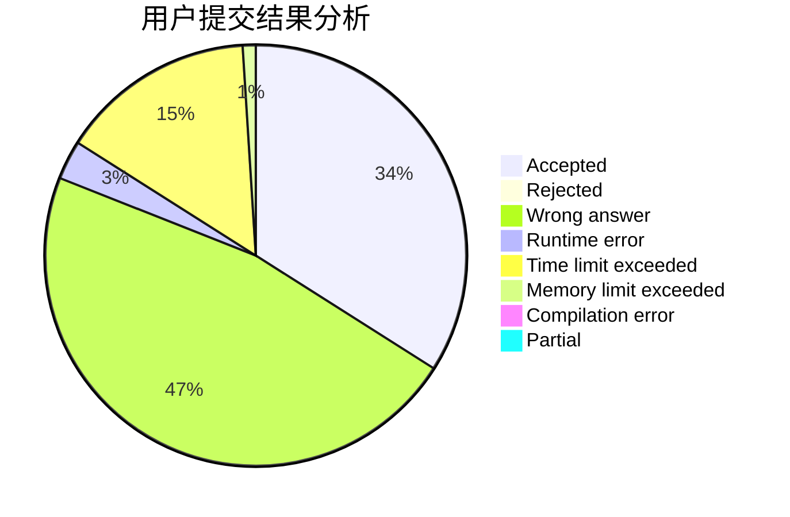
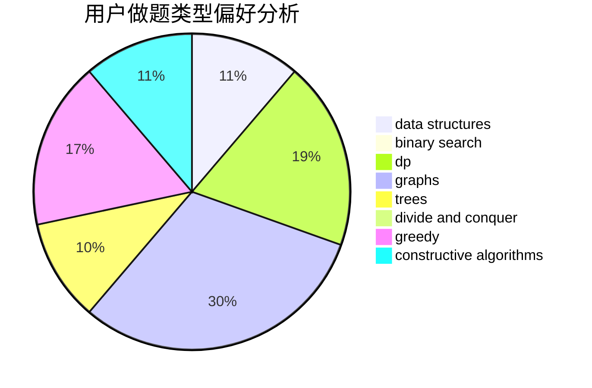
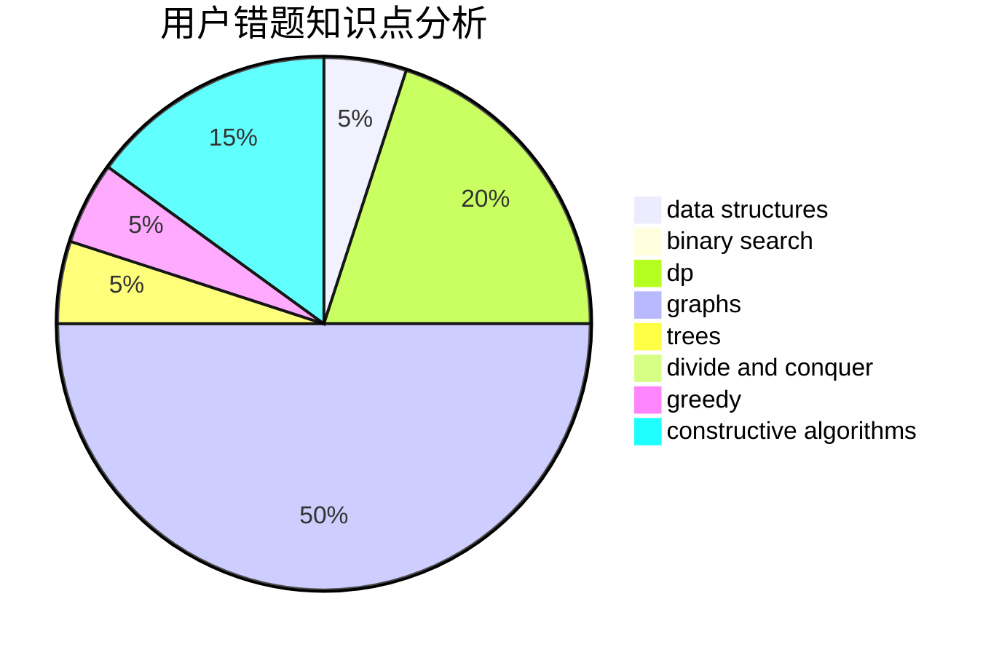

# CallmeChallenger

<!-- tabs:start -->

#### **用户提交结果分析**

#### **用户做题类型偏好分析**

#### **用户错题知识点分析**

<!-- tabs:end -->
# 推荐题目
[1284C](https://codeforces.com/contest/1284/problem/C)		combinatorics,
                        math		  
[1500C](https://codeforces.com/contest/1500/problem/C)		bitmasks,
                        brute force,
                        constructive algorithms,
                        greedy,
                        two pointers		  
[659F](https://codeforces.com/contest/659/problem/F)		dfs and similar,
                        dsu,
                        graphs,
                        greedy,
                        sortings		  
[659E](https://codeforces.com/contest/659/problem/E)		data structures,
                        dfs and similar,
                        dsu,
                        graphs,
                        greedy		  
[318A](https://codeforces.com/contest/318/problem/A)		math		  
[659D](https://codeforces.com/contest/659/problem/D)		geometry,
                        implementation,
                        math		  
[515D](https://codeforces.com/contest/515/problem/D)		constructive algorithms,
                        greedy		  
[1340E](https://codeforces.com/contest/1340/problem/E)		graphs,
                        interactive,
                        probabilities		  
[660B](https://codeforces.com/contest/660/problem/B)		implementation		  
[659G](https://codeforces.com/contest/659/problem/G)		combinatorics,
                        dp,
                        number theory		  
