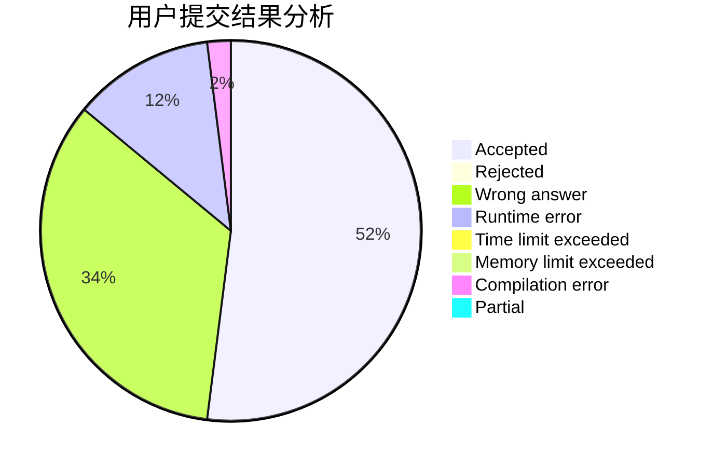
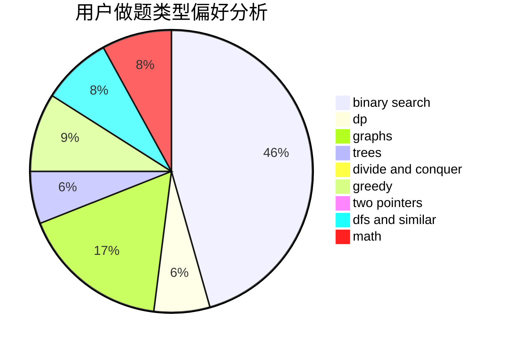

# widsnoy

<!-- tabs:start -->

#### **用户提交结果分析**

#### **用户做题类型偏好分析**

<!-- tabs:end -->
# 推荐题目
[1510C](https://codeforces.com/contest/1510/problem/C)
[1296F](https://codeforces.com/contest/1296/problem/F)
[759B](https://codeforces.com/contest/759/problem/B)
[1230F](https://codeforces.com/contest/1230/problem/F)
[1019A](https://codeforces.com/contest/1019/problem/A)
[768C](https://codeforces.com/contest/768/problem/C)
[934B](https://codeforces.com/contest/934/problem/B)
[1236E](https://codeforces.com/contest/1236/problem/E)
[86B](https://codeforces.com/contest/86/problem/B)
[779C](https://codeforces.com/contest/779/problem/C)
