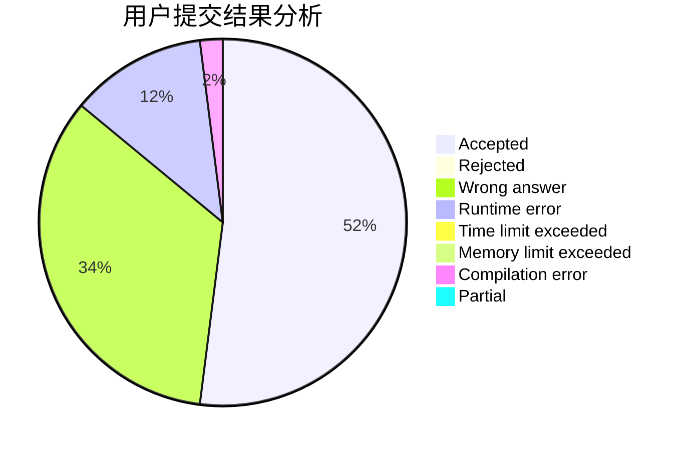
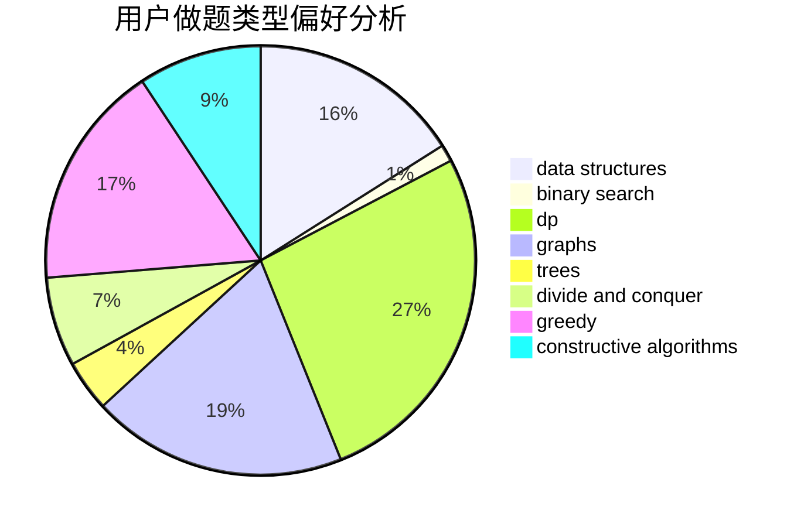
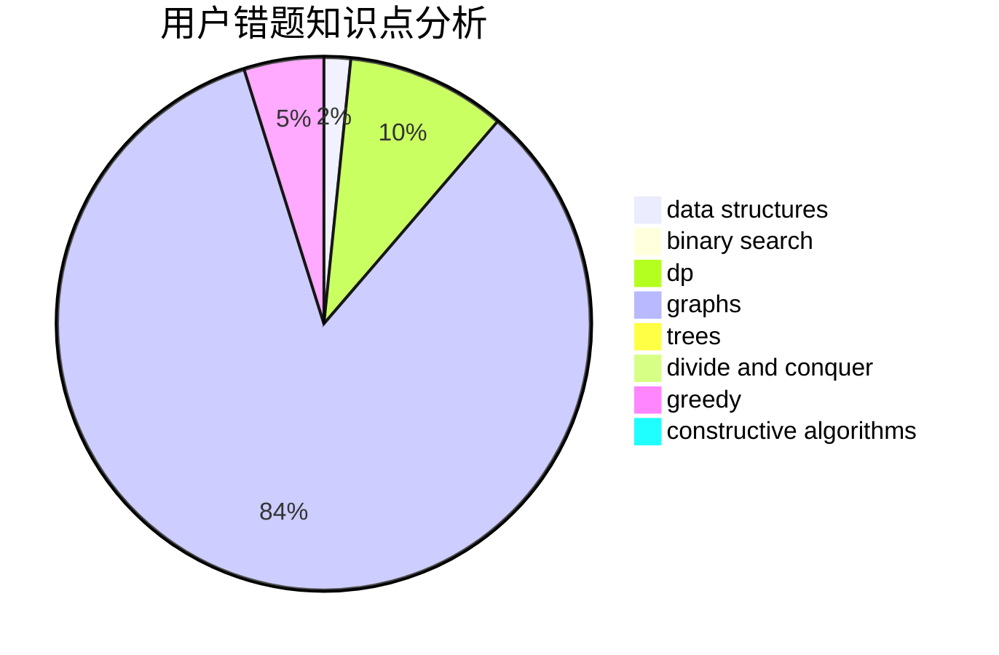

# widsnoy

<!-- tabs:start -->

#### **用户提交结果分析**

#### **用户做题类型偏好分析**

#### **用户错题知识点分析**

<!-- tabs:end -->
# 推荐题目
[14B](https://codeforces.com/contest/14/problem/B)		implementation		  
[1290C](https://codeforces.com/contest/1290/problem/C)		dfs and similar,
                        dsu,
                        graphs		  
[737E](https://codeforces.com/contest/737/problem/E)		graph matchings,
                        graphs,
                        greedy,
                        schedules		  
[1223G](https://codeforces.com/contest/1223/problem/G)		binary search,
                        math,
                        number theory		  
[1017E](https://codeforces.com/contest/1017/problem/E)		geometry,
                        hashing,
                        strings		  
[749C](https://codeforces.com/contest/749/problem/C)		greedy,
                        implementation,
                        two pointers		  
[914F](https://codeforces.com/contest/914/problem/F)		bitmasks,
                        brute force,
                        data structures,
                        string suffix structures,
                        strings		  
[1227G](https://codeforces.com/contest/1227/problem/G)		constructive algorithms		  
[851A](https://codeforces.com/contest/851/problem/A)		implementation,
                        math		  
[759E](https://codeforces.com/contest/759/problem/E)		dsu,graphs,sortings,trees		  
