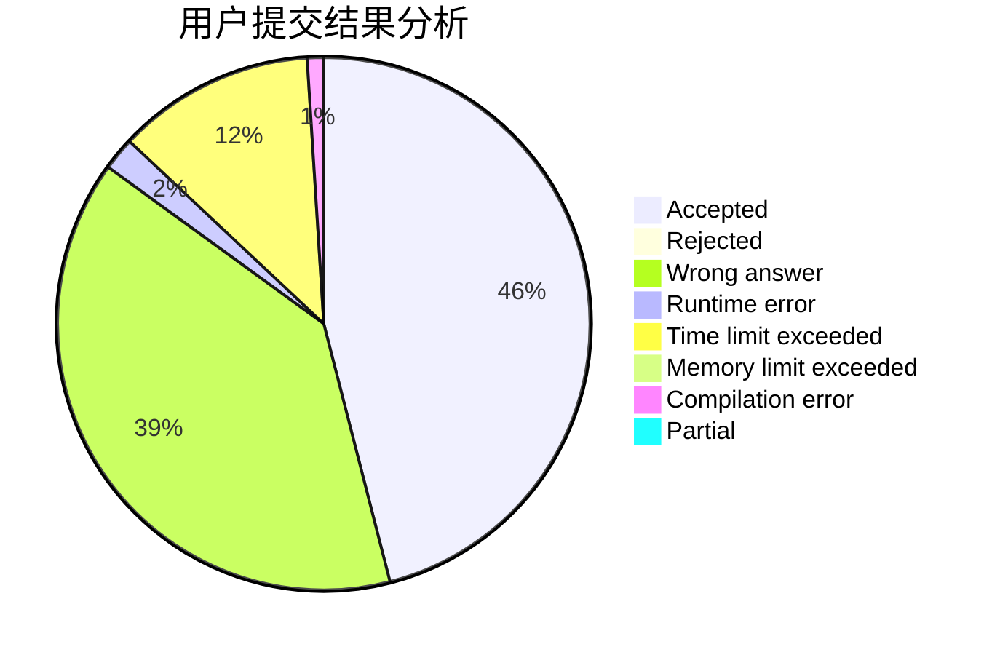
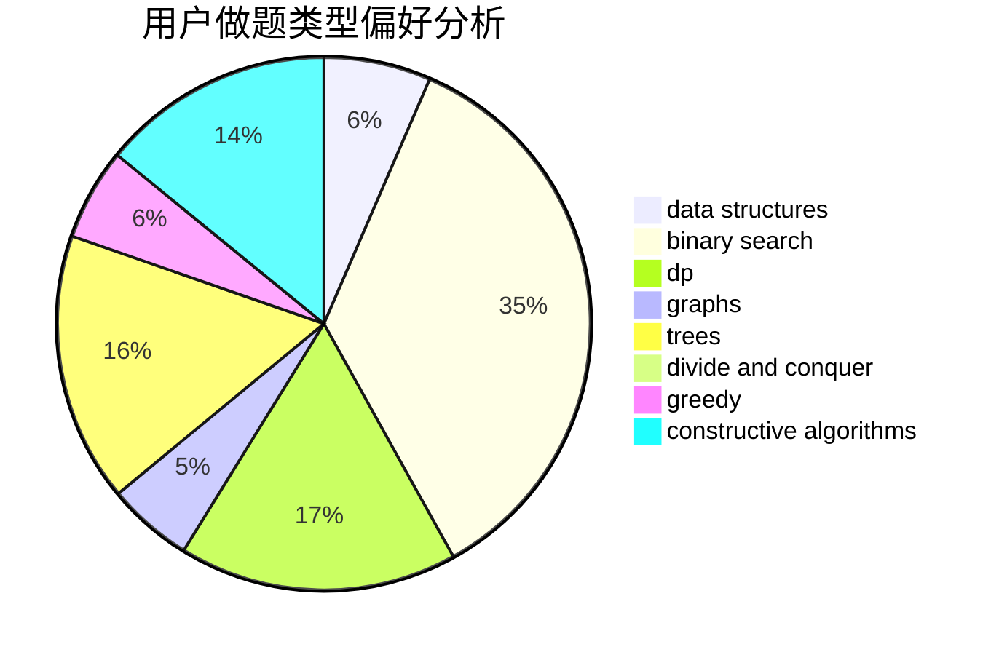
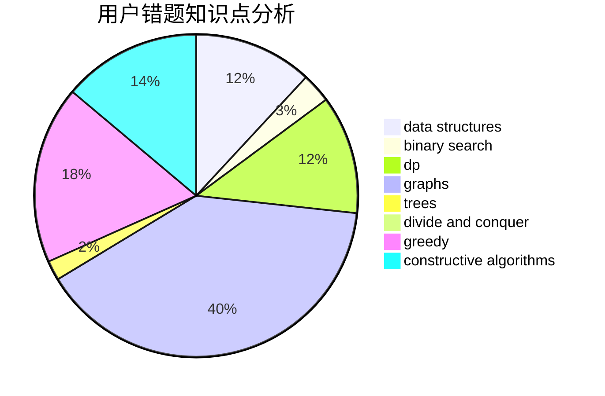

# wifiiii

<!-- tabs:start -->

#### **用户提交结果分析**

#### **用户做题类型偏好分析**

#### **用户错题知识点分析**

<!-- tabs:end -->
# 推荐题目
[585F](https://codeforces.com/contest/585/problem/F)		dp,
                        implementation,
                        strings		  
[67A](https://codeforces.com/contest/67/problem/A)		dp,
                        graphs,
                        greedy,
                        implementation		  
[1482D](https://codeforces.com/contest/1482/problem/D)		data structures,
                        dsu,
                        implementation,
                        shortest paths		  
[377E](https://codeforces.com/contest/377/problem/E)		dp,
                        geometry		  
[1119F](https://codeforces.com/contest/1119/problem/F)		data structures,
                        dp,
                        trees		  
[800B](https://codeforces.com/contest/800/problem/B)		dsu,graphs,sortings,trees		  
[13782](https://codeforces.com/contest/1378/problem/2)		dsu,graphs,sortings,trees		  
[725G](https://codeforces.com/contest/725/problem/G)		nan		  
[1305H](https://codeforces.com/contest/1305/problem/H)		binary search,
                        greedy		  
[1044F](https://codeforces.com/contest/1044/problem/F)		data structures		  
