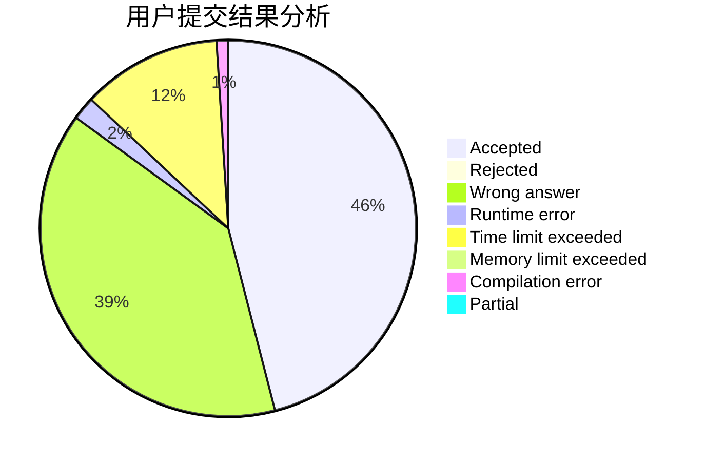
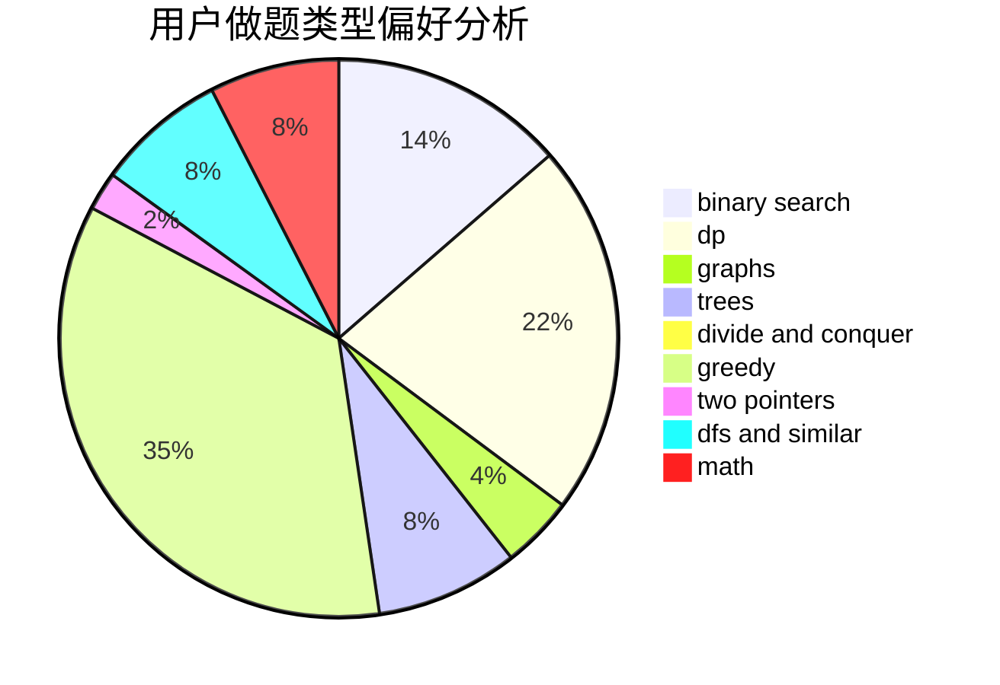

# wifiiii

<!-- tabs:start -->

#### **用户提交结果分析**

#### **用户做题类型偏好分析**

<!-- tabs:end -->
# 推荐题目
[585F](https://codeforces.com/contest/585/problem/F)
[67A](https://codeforces.com/contest/67/problem/A)
[1482D](https://codeforces.com/contest/1482/problem/D)
[377E](https://codeforces.com/contest/377/problem/E)
[1119F](https://codeforces.com/contest/1119/problem/F)
[800B](https://codeforces.com/contest/800/problem/B)
[13782](https://codeforces.com/contest/1378/problem/2)
[725G](https://codeforces.com/contest/725/problem/G)
[1305H](https://codeforces.com/contest/1305/problem/H)
[1044F](https://codeforces.com/contest/1044/problem/F)
