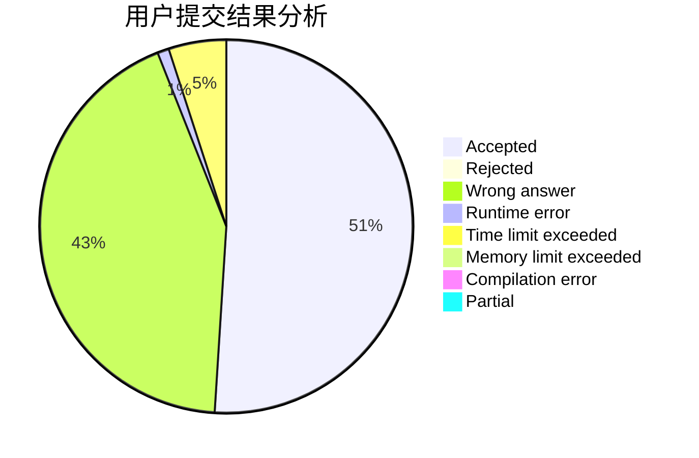
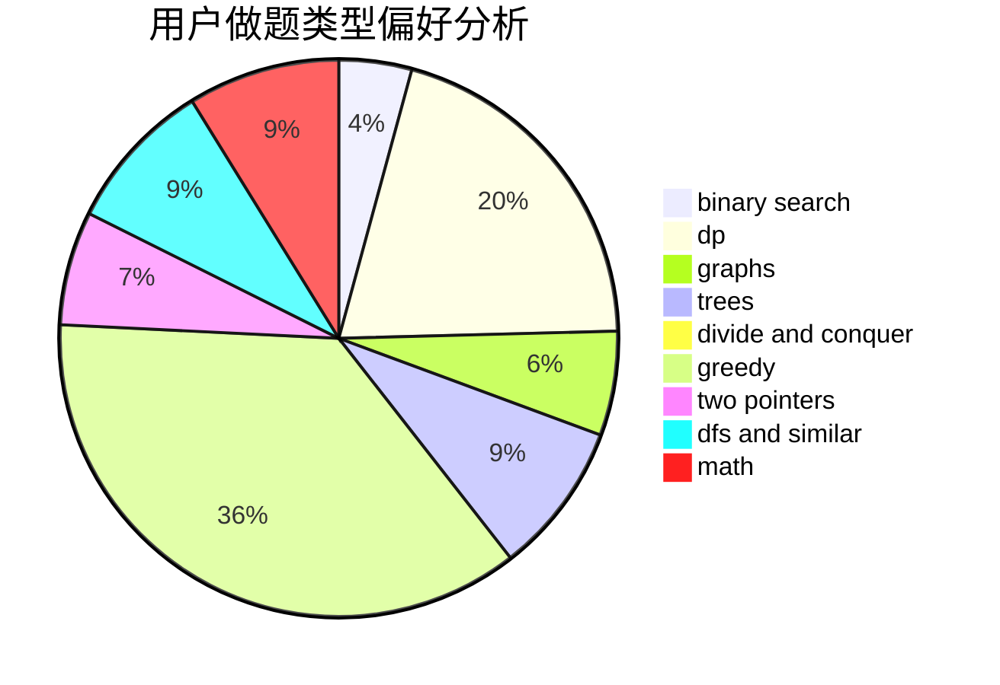

# william555

<!-- tabs:start -->

#### **用户提交结果分析**

#### **用户做题类型偏好分析**

<!-- tabs:end -->
# 推荐题目
[1350D](https://codeforces.com/contest/1350/problem/D)
[1295F](https://codeforces.com/contest/1295/problem/F)
[1210E](https://codeforces.com/contest/1210/problem/E)
[1045C](https://codeforces.com/contest/1045/problem/C)
[1214E](https://codeforces.com/contest/1214/problem/E)
[795K](https://codeforces.com/contest/795/problem/K)
[1154E](https://codeforces.com/contest/1154/problem/E)
[13562](https://codeforces.com/contest/1356/problem/2)
[312C](https://codeforces.com/contest/312/problem/C)
[109B](https://codeforces.com/contest/109/problem/B)
