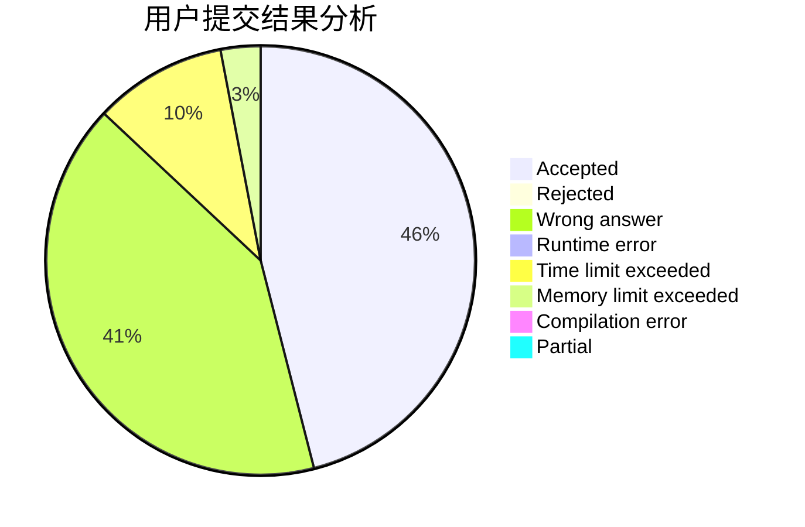
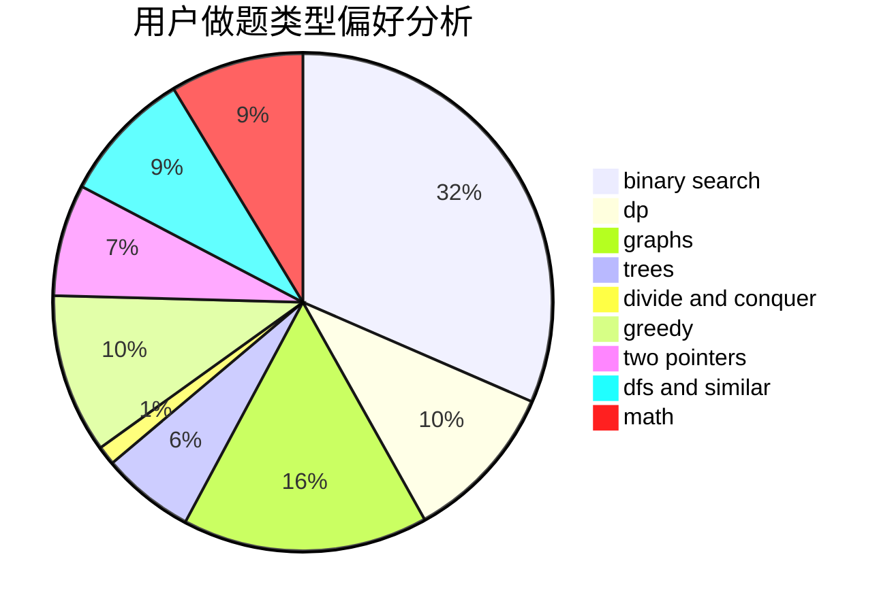

# willingox

<!-- tabs:start -->

#### **用户提交结果分析**

#### **用户做题类型偏好分析**

<!-- tabs:end -->
# 推荐题目
[1310B](https://codeforces.com/contest/1310/problem/B)
[1203A](https://codeforces.com/contest/1203/problem/A)
[1045J](https://codeforces.com/contest/1045/problem/J)
[987A](https://codeforces.com/contest/987/problem/A)
[809C](https://codeforces.com/contest/809/problem/C)
[1246C](https://codeforces.com/contest/1246/problem/C)
[29E](https://codeforces.com/contest/29/problem/E)
[1229D](https://codeforces.com/contest/1229/problem/D)
[756A](https://codeforces.com/contest/756/problem/A)
[1277D](https://codeforces.com/contest/1277/problem/D)
