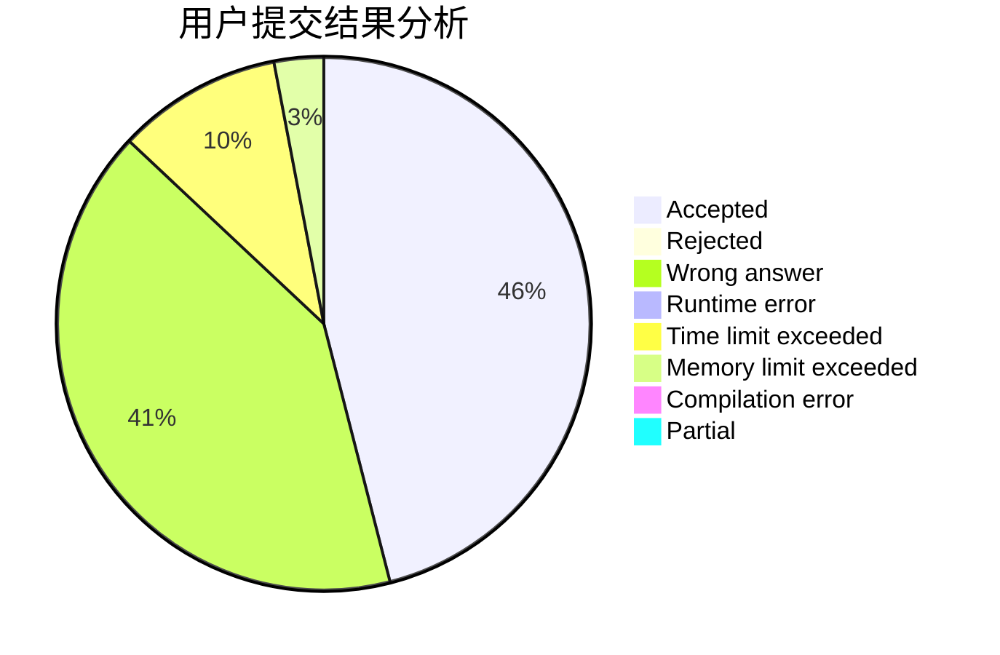
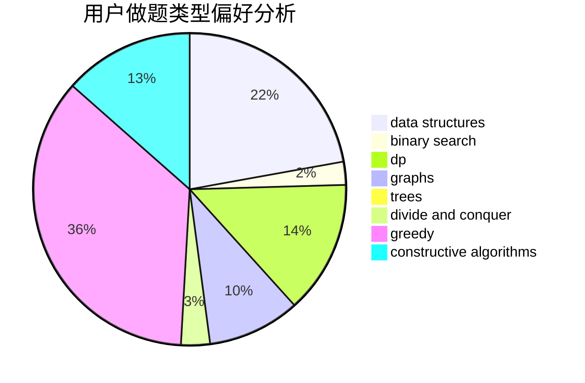

# willingox

<!-- tabs:start -->

#### **用户提交结果分析**

#### **用户做题类型偏好分析**

#### **用户错题知识点分析**

<!-- tabs:end -->
# 推荐题目
[1300D](https://codeforces.com/contest/1300/problem/D)		dsu,graphs,sortings,trees		  
[1199E](https://codeforces.com/contest/1199/problem/E)		dsu,graphs,sortings,trees		  
[1045G](https://codeforces.com/contest/1045/problem/G)		data structures		  
[965A](https://codeforces.com/contest/965/problem/A)		math		  
[794B](https://codeforces.com/contest/794/problem/B)		geometry,
                        math		  
[1240F](https://codeforces.com/contest/1240/problem/F)		graphs		  
[283E](https://codeforces.com/contest/283/problem/E)		combinatorics,
                        data structures,
                        math		  
[1221C](https://codeforces.com/contest/1221/problem/C)		binary search,
                        math		  
[735B](https://codeforces.com/contest/735/problem/B)		greedy,
                        number theory,
                        sortings		  
[1268C](https://codeforces.com/contest/1268/problem/C)		binary search,
                        data structures		  
