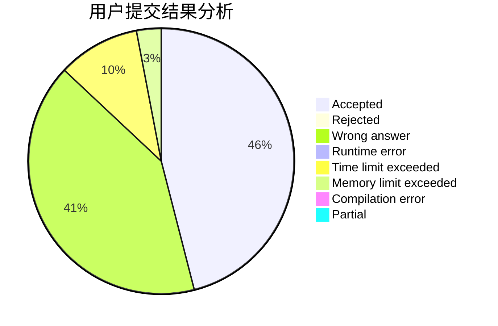
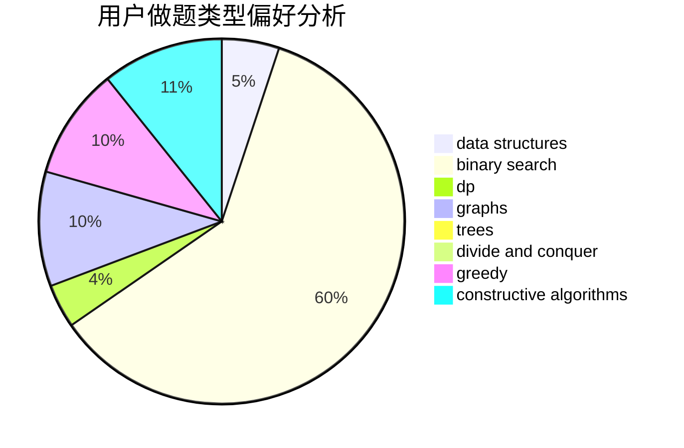

# willingox

<!-- tabs:start -->

#### **用户提交结果分析**

#### **用户做题类型偏好分析**

#### **用户错题知识点分析**

<!-- tabs:end -->
# 推荐题目
[1310B](https://codeforces.com/contest/1310/problem/B)		dp,
                        implementation		  
[1203A](https://codeforces.com/contest/1203/problem/A)		implementation		  
[1045J](https://codeforces.com/contest/1045/problem/J)		data structures,
                        strings,
                        trees		  
[987A](https://codeforces.com/contest/987/problem/A)		implementation		  
[809C](https://codeforces.com/contest/809/problem/C)		combinatorics,
                        divide and conquer,
                        dp		  
[1246C](https://codeforces.com/contest/1246/problem/C)		dsu,graphs,sortings,trees		  
[29E](https://codeforces.com/contest/29/problem/E)		graphs,
                        shortest paths		  
[1229D](https://codeforces.com/contest/1229/problem/D)		dsu,graphs,sortings,trees		  
[756A](https://codeforces.com/contest/756/problem/A)		constructive algorithms,
                        dfs and similar		  
[1277D](https://codeforces.com/contest/1277/problem/D)		data structures,
                        hashing,
                        implementation,
                        math		  
