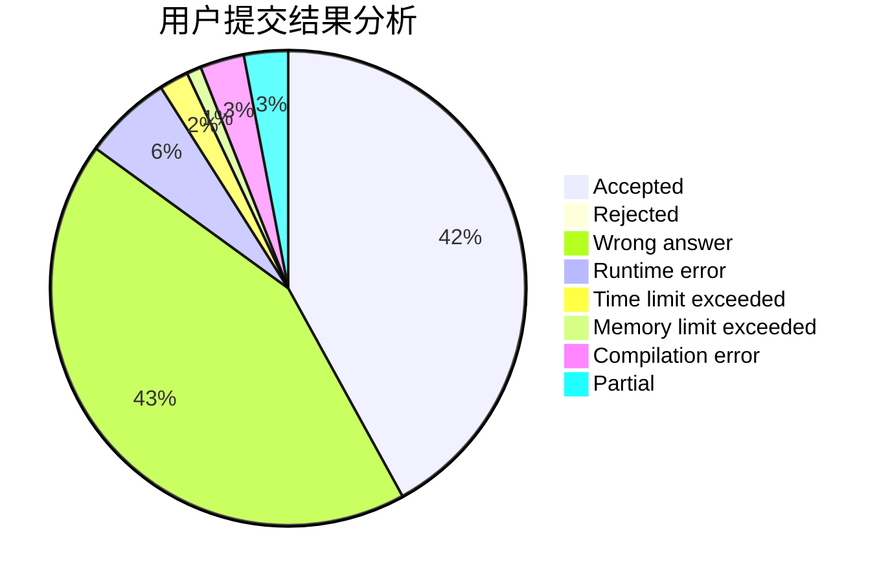
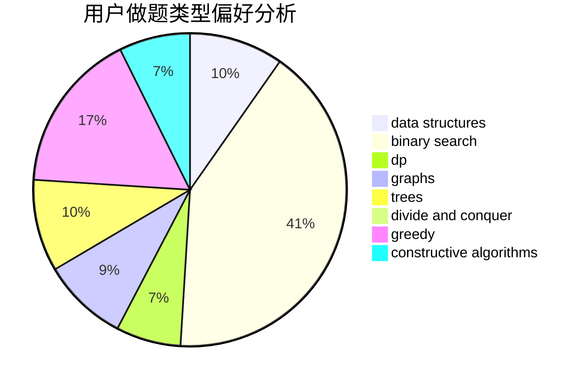
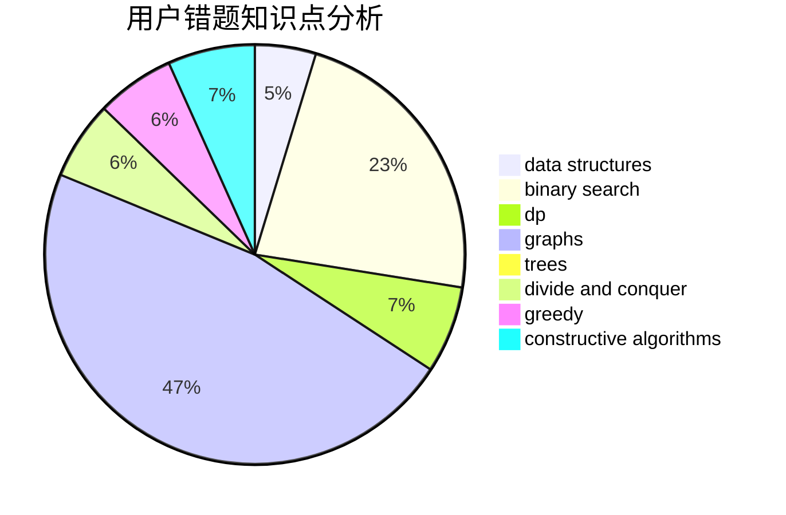

# wilson_

<!-- tabs:start -->

#### **用户提交结果分析**

#### **用户做题类型偏好分析**

#### **用户错题知识点分析**

<!-- tabs:end -->
# 推荐题目
[1343D](https://codeforces.com/contest/1343/problem/D)		brute force,
                        data structures,
                        greedy,
                        two pointers		  
[1328C](https://codeforces.com/contest/1328/problem/C)		greedy,
                        implementation		  
[840D](https://codeforces.com/contest/840/problem/D)		data structures,
                        probabilities		  
[466D](https://codeforces.com/contest/466/problem/D)		combinatorics,
                        dp		  
[56B](https://codeforces.com/contest/56/problem/B)		implementation		  
[1403A](https://codeforces.com/contest/1403/problem/A)		*special problem,
                        2-sat,
                        binary search,
                        data structures,
                        graphs,
                        interactive,
                        sortings,
                        two pointers		  
[965B](https://codeforces.com/contest/965/problem/B)		implementation		  
[991A](https://codeforces.com/contest/991/problem/A)		implementation		  
[1037G](https://codeforces.com/contest/1037/problem/G)		games		  
[917E](https://codeforces.com/contest/917/problem/E)		data structures,
                        string suffix structures,
                        strings,
                        trees		  
