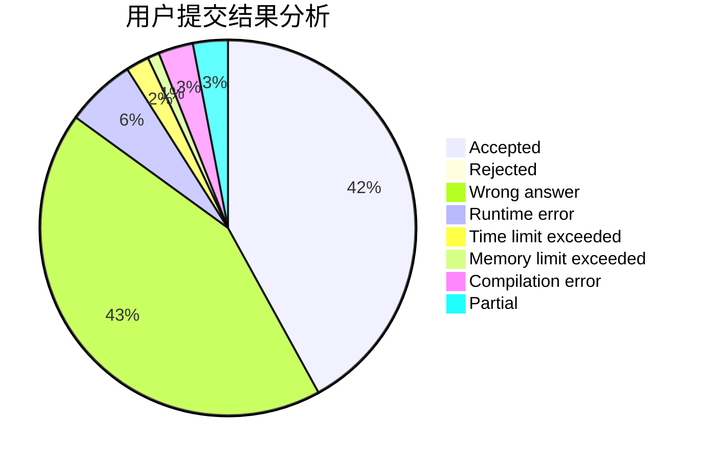
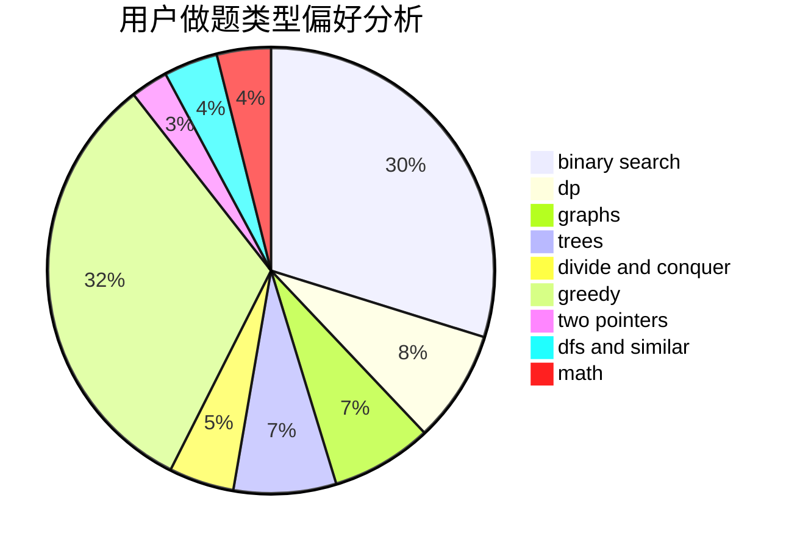

# wilson_

<!-- tabs:start -->

#### **用户提交结果分析**

#### **用户做题类型偏好分析**

<!-- tabs:end -->
# 推荐题目
[1343D](https://codeforces.com/contest/1343/problem/D)
[1328C](https://codeforces.com/contest/1328/problem/C)
[840D](https://codeforces.com/contest/840/problem/D)
[466D](https://codeforces.com/contest/466/problem/D)
[56B](https://codeforces.com/contest/56/problem/B)
[1403A](https://codeforces.com/contest/1403/problem/A)
[965B](https://codeforces.com/contest/965/problem/B)
[991A](https://codeforces.com/contest/991/problem/A)
[1037G](https://codeforces.com/contest/1037/problem/G)
[917E](https://codeforces.com/contest/917/problem/E)
