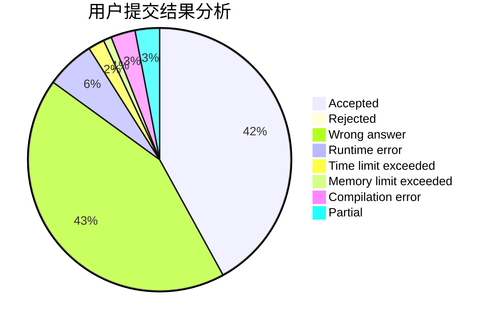
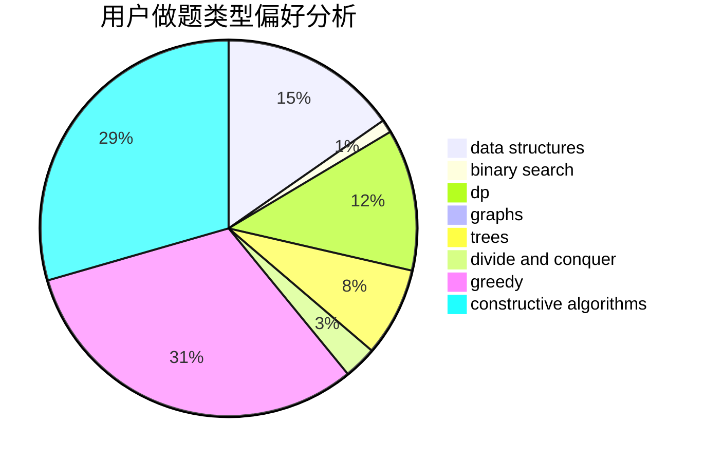
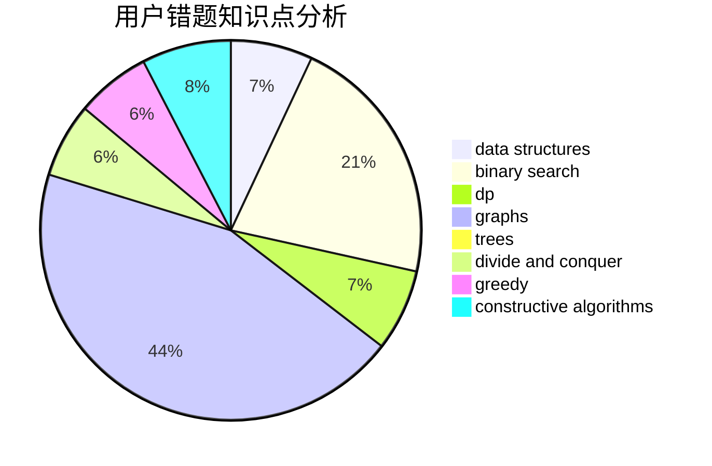

# wilson_

<!-- tabs:start -->

#### **用户提交结果分析**

#### **用户做题类型偏好分析**

#### **用户错题知识点分析**

<!-- tabs:end -->
# 推荐题目
[1336C](https://codeforces.com/contest/1336/problem/C)		dp,
                        strings		  
[1321D](https://codeforces.com/contest/1321/problem/D)		dsu,graphs,sortings,trees		  
[820D](https://codeforces.com/contest/820/problem/D)		dsu,graphs,sortings,trees		  
[446C](https://codeforces.com/contest/446/problem/C)		data structures,
                        math,
                        number theory		  
[545B](https://codeforces.com/contest/545/problem/B)		greedy		  
[1394E](https://codeforces.com/contest/1394/problem/E)		strings		  
[948A](https://codeforces.com/contest/948/problem/A)		brute force,
                        dfs and similar,
                        graphs,
                        implementation		  
[977C](https://codeforces.com/contest/977/problem/C)		sortings		  
[1037D](https://codeforces.com/contest/1037/problem/D)		dfs and similar,
                        graphs,
                        shortest paths,
                        trees		  
[901B](https://codeforces.com/contest/901/problem/B)		constructive algorithms,
                        math		  
