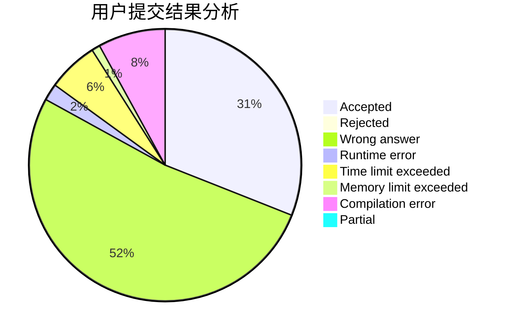
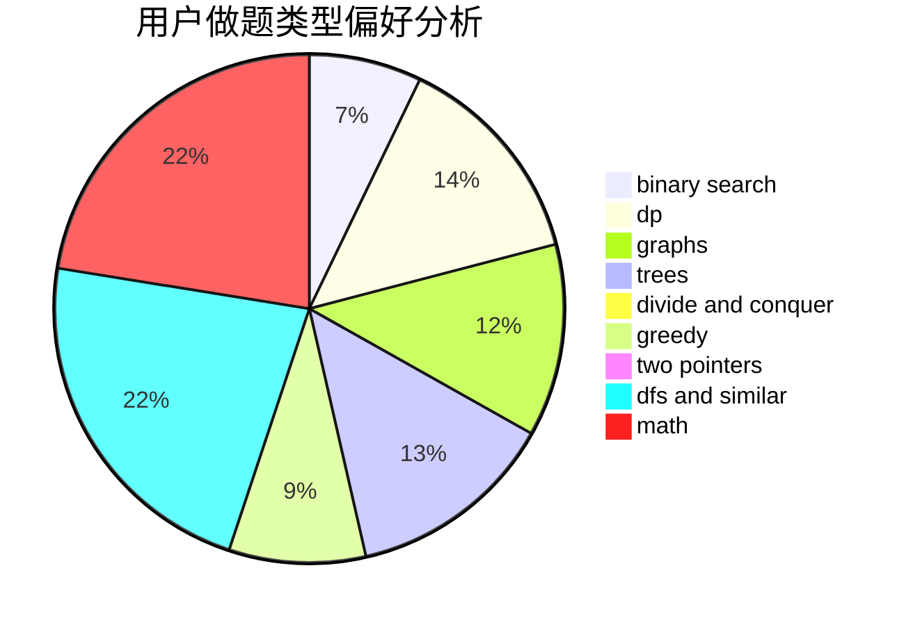

# wind_cross

<!-- tabs:start -->

#### **用户提交结果分析**

#### **用户做题类型偏好分析**

<!-- tabs:end -->
# 推荐题目
[922B](https://codeforces.com/contest/922/problem/B)
[1061F](https://codeforces.com/contest/1061/problem/F)
[13783](https://codeforces.com/contest/1378/problem/3)
[535B](https://codeforces.com/contest/535/problem/B)
[190E](https://codeforces.com/contest/190/problem/E)
[38C](https://codeforces.com/contest/38/problem/C)
[673B](https://codeforces.com/contest/673/problem/B)
[1023E](https://codeforces.com/contest/1023/problem/E)
[1293A](https://codeforces.com/contest/1293/problem/A)
[788C](https://codeforces.com/contest/788/problem/C)
