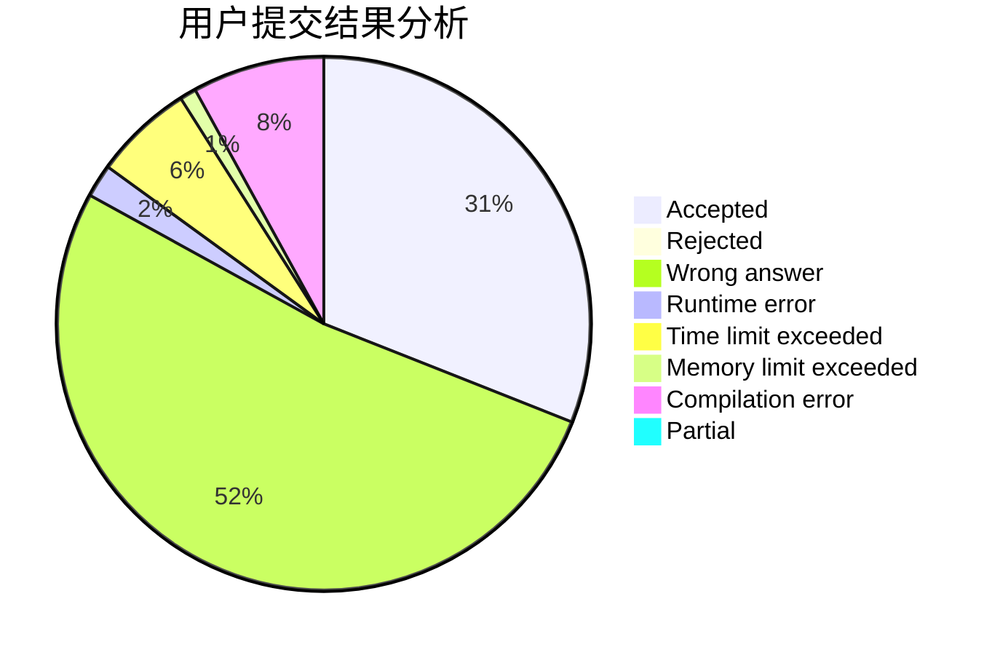
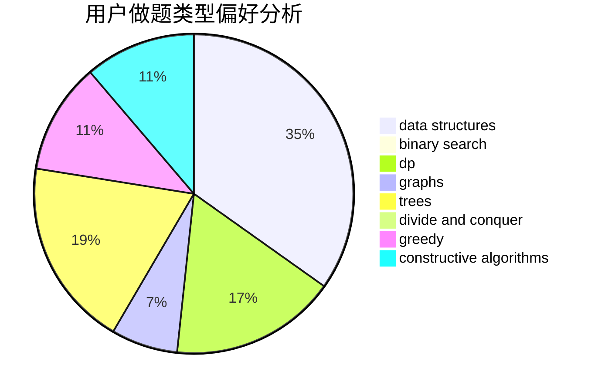
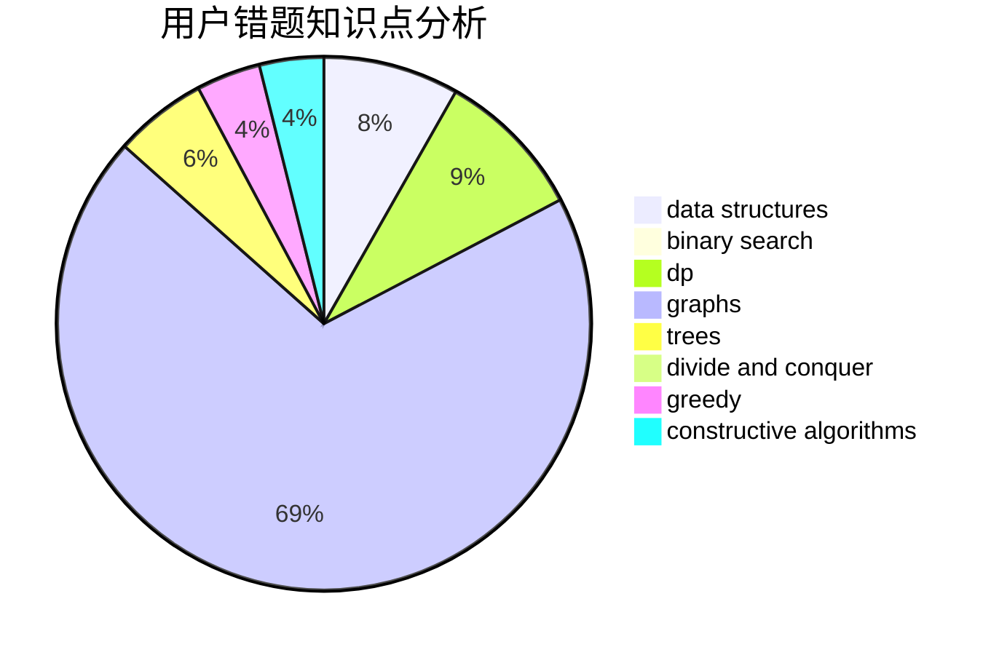

# wind_cross

<!-- tabs:start -->

#### **用户提交结果分析**

#### **用户做题类型偏好分析**

#### **用户错题知识点分析**

<!-- tabs:end -->
# 推荐题目
[922B](https://codeforces.com/contest/922/problem/B)		brute force		  
[1061F](https://codeforces.com/contest/1061/problem/F)		interactive,
                        probabilities		  
[13783](https://codeforces.com/contest/1378/problem/3)		dsu,graphs,sortings,trees		  
[535B](https://codeforces.com/contest/535/problem/B)		bitmasks,
                        brute force,
                        combinatorics,
                        implementation		  
[190E](https://codeforces.com/contest/190/problem/E)		data structures,
                        dsu,
                        graphs,
                        hashing,
                        sortings		  
[38C](https://codeforces.com/contest/38/problem/C)		brute force		  
[673B](https://codeforces.com/contest/673/problem/B)		greedy,
                        implementation		  
[1023E](https://codeforces.com/contest/1023/problem/E)		constructive algorithms,
                        interactive,
                        matrices		  
[1293A](https://codeforces.com/contest/1293/problem/A)		binary search,
                        brute force,
                        implementation		  
[788C](https://codeforces.com/contest/788/problem/C)		dfs and similar,
                        graphs,
                        shortest paths		  
