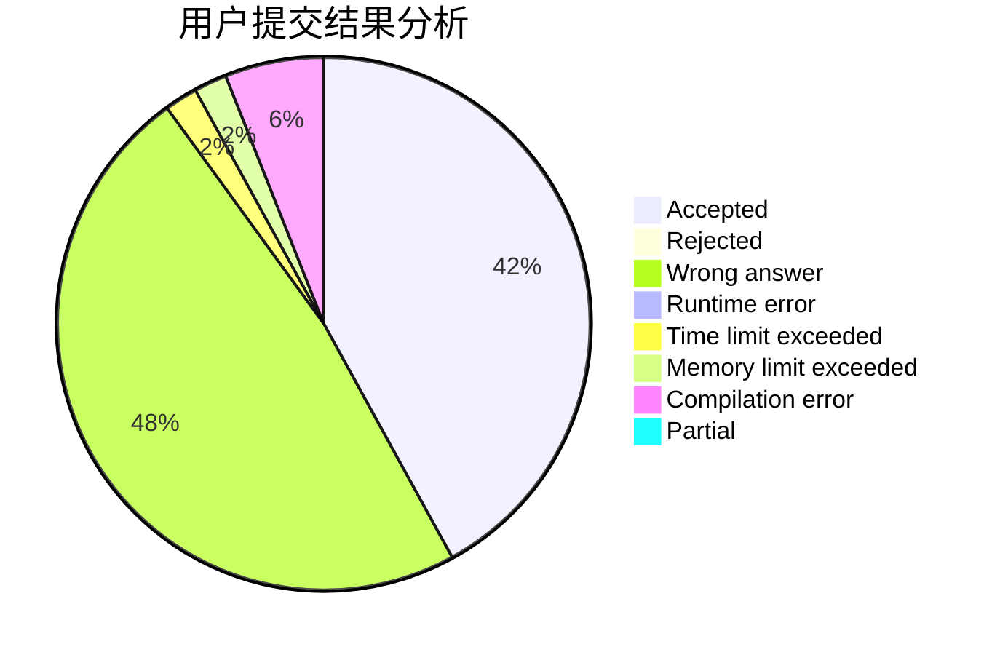
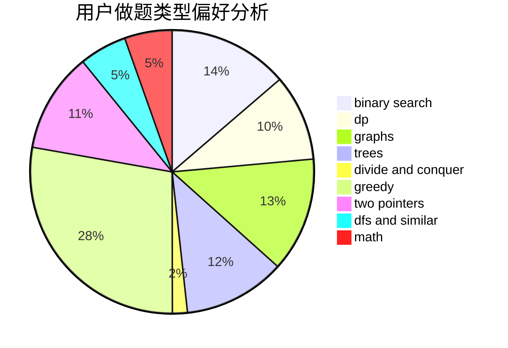

# winddust

<!-- tabs:start -->

#### **用户提交结果分析**

#### **用户做题类型偏好分析**

<!-- tabs:end -->
# 推荐题目
[1059B](https://codeforces.com/contest/1059/problem/B)
[497D](https://codeforces.com/contest/497/problem/D)
[1133A](https://codeforces.com/contest/1133/problem/A)
[463B](https://codeforces.com/contest/463/problem/B)
[1307E](https://codeforces.com/contest/1307/problem/E)
[715A](https://codeforces.com/contest/715/problem/A)
[1195A](https://codeforces.com/contest/1195/problem/A)
[1283A](https://codeforces.com/contest/1283/problem/A)
[710D](https://codeforces.com/contest/710/problem/D)
[1294F](https://codeforces.com/contest/1294/problem/F)
