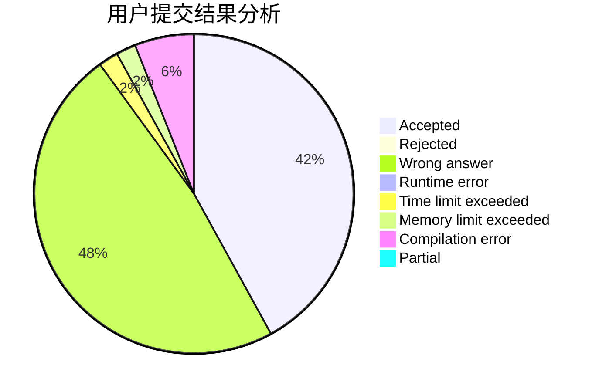
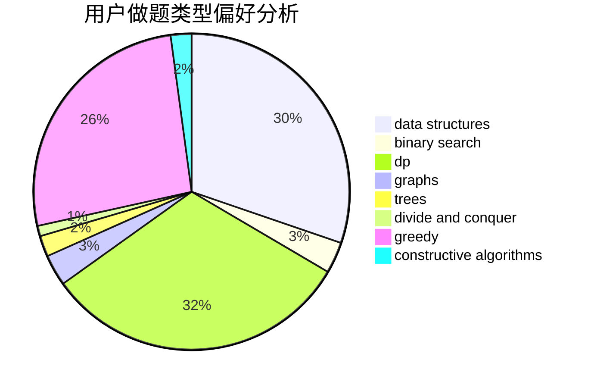

# winddust

<!-- tabs:start -->

#### **用户提交结果分析**

#### **用户做题类型偏好分析**

#### **用户错题知识点分析**

<!-- tabs:end -->
# 推荐题目
[1059B](https://codeforces.com/contest/1059/problem/B)		implementation		  
[497D](https://codeforces.com/contest/497/problem/D)		brute force,
                        geometry,
                        math		  
[1133A](https://codeforces.com/contest/1133/problem/A)		implementation		  
[463B](https://codeforces.com/contest/463/problem/B)		brute force,
                        implementation,
                        math		  
[1307E](https://codeforces.com/contest/1307/problem/E)		binary search,
                        combinatorics,
                        dp,
                        greedy,
                        implementation,
                        math		  
[715A](https://codeforces.com/contest/715/problem/A)		constructive algorithms,
                        math		  
[1195A](https://codeforces.com/contest/1195/problem/A)		greedy,
                        math		  
[1283A](https://codeforces.com/contest/1283/problem/A)		math		  
[710D](https://codeforces.com/contest/710/problem/D)		math,
                        number theory		  
[1294F](https://codeforces.com/contest/1294/problem/F)		dfs and similar,
                        dp,
                        greedy,
                        trees		  
