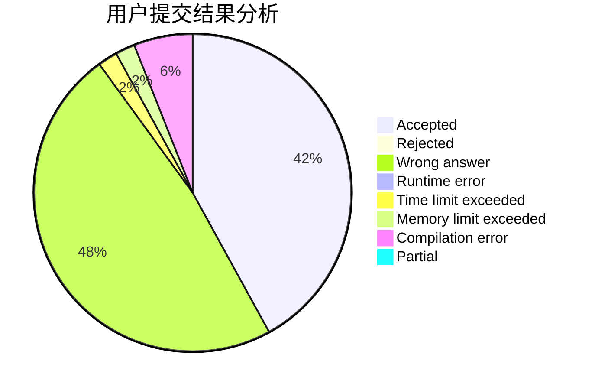
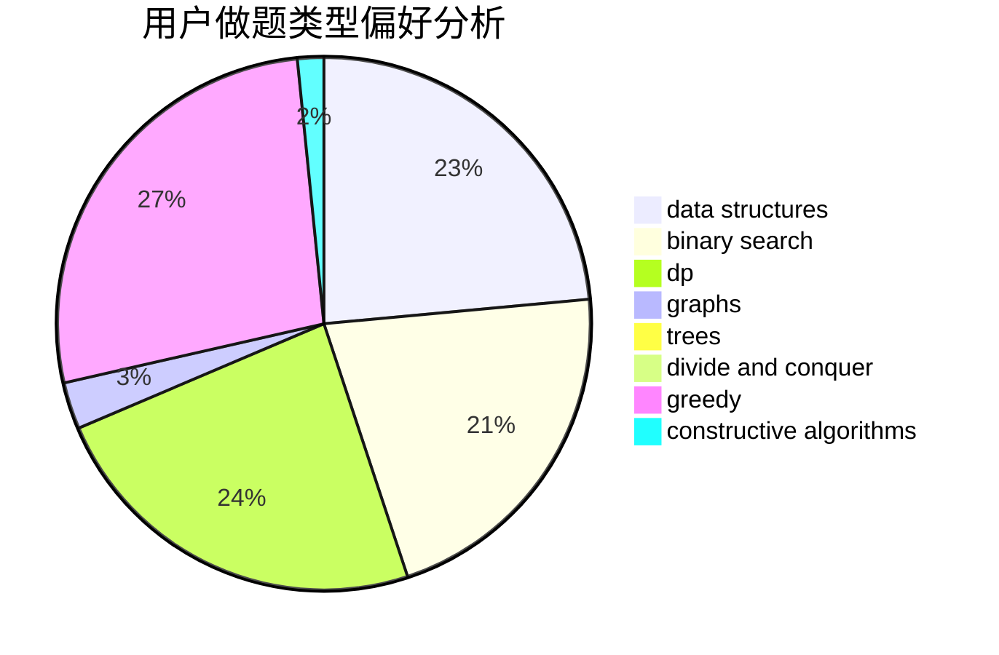

# winddust

<!-- tabs:start -->

#### **用户提交结果分析**

#### **用户做题类型偏好分析**

#### **用户错题知识点分析**

<!-- tabs:end -->
# 推荐题目
[1058D](https://codeforces.com/contest/1058/problem/D)		dsu,graphs,sortings,trees		  
[477D](https://codeforces.com/contest/477/problem/D)		dp,
                        strings		  
[1131D](https://codeforces.com/contest/1131/problem/D)		dfs and similar,
                        dp,
                        dsu,
                        graphs,
                        greedy		  
[442D](https://codeforces.com/contest/442/problem/D)		data structures,
                        trees		  
[12D](https://codeforces.com/contest/12/problem/D)		data structures,
                        sortings		  
[698C](https://codeforces.com/contest/698/problem/C)		bitmasks,
                        dp,
                        math,
                        probabilities		  
[118A](https://codeforces.com/contest/118/problem/A)		implementation,
                        strings		  
[1276E](https://codeforces.com/contest/1276/problem/E)		constructive algorithms		  
[690D1](https://codeforces.com/contest/690D/problem/1)		nan		  
[1287C](https://codeforces.com/contest/1287/problem/C)		dsu,graphs,sortings,trees		  
