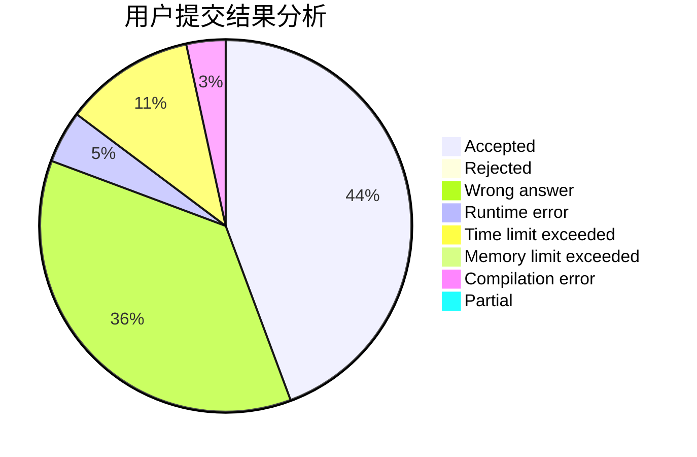
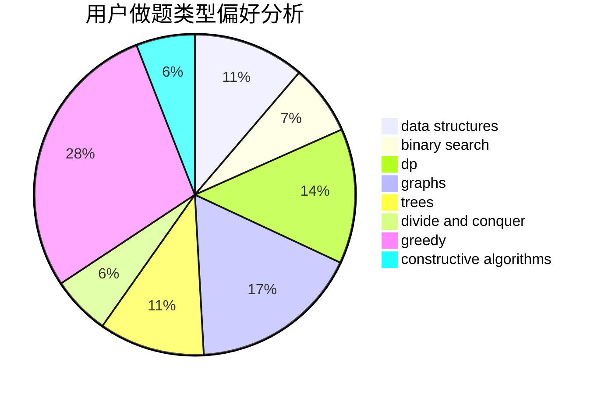

# windy7926778

<!-- tabs:start -->

#### **用户提交结果分析**

#### **用户做题类型偏好分析**

#### **用户错题知识点分析**

<!-- tabs:end -->
# 推荐题目
[380E](https://codeforces.com/contest/380/problem/E)		data structures		  
[851D](https://codeforces.com/contest/851/problem/D)		dsu,graphs,sortings,trees		  
[516C](https://codeforces.com/contest/516/problem/C)		dsu,graphs,sortings,trees		  
[543B](https://codeforces.com/contest/543/problem/B)		constructive algorithms,
                        graphs,
                        shortest paths		  
[734A](https://codeforces.com/contest/734/problem/A)		implementation,
                        strings		  
[975A](https://codeforces.com/contest/975/problem/A)		implementation,
                        strings		  
[1000C](https://codeforces.com/contest/1000/problem/C)		data structures,
                        implementation,
                        sortings		  
[1291F](https://codeforces.com/contest/1291/problem/F)		graphs,
                        interactive		  
[471C](https://codeforces.com/contest/471/problem/C)		binary search,
                        brute force,
                        greedy,
                        math		  
[513C](https://codeforces.com/contest/513/problem/C)		bitmasks,
                        probabilities		  
