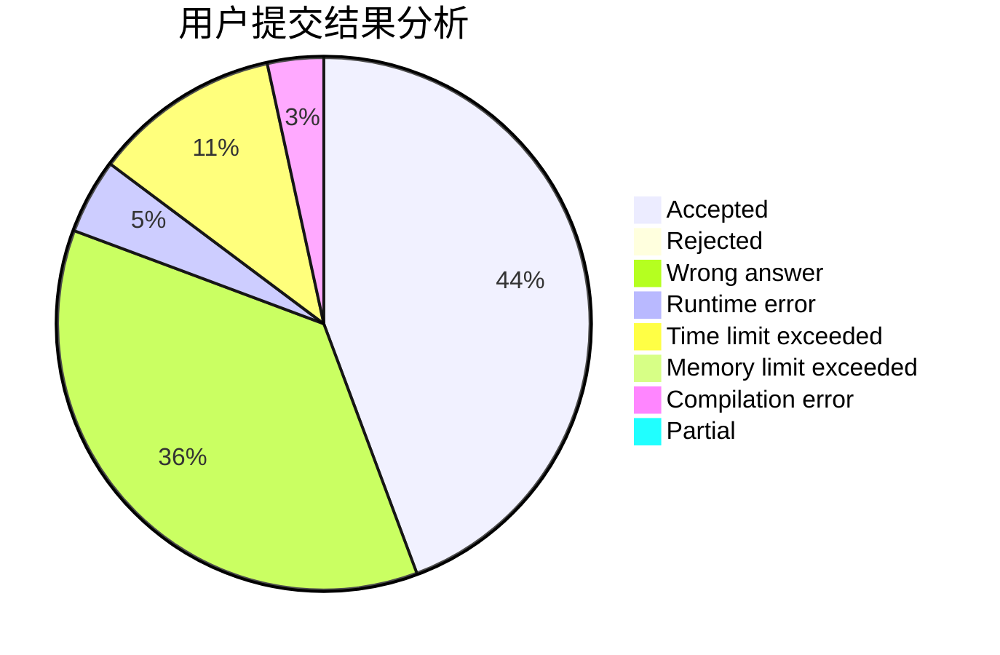
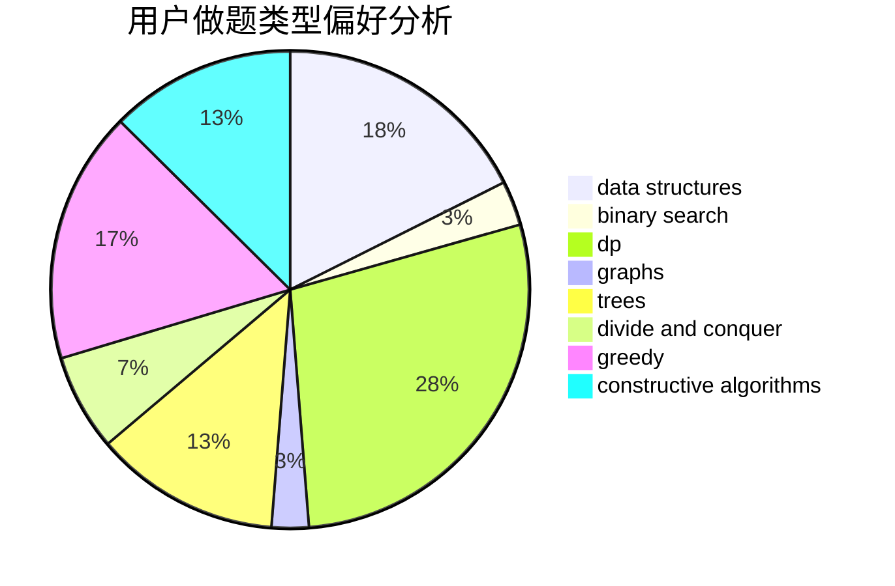

# windy7926778

<!-- tabs:start -->

#### **用户提交结果分析**

#### **用户做题类型偏好分析**

#### **用户错题知识点分析**

<!-- tabs:end -->
# 推荐题目
[412D](https://codeforces.com/contest/412/problem/D)		dfs and similar		  
[870A](https://codeforces.com/contest/870/problem/A)		brute force,
                        implementation		  
[543C](https://codeforces.com/contest/543/problem/C)		bitmasks,
                        dp		  
[567D](https://codeforces.com/contest/567/problem/D)		binary search,
                        data structures,
                        greedy,
                        sortings		  
[754C](https://codeforces.com/contest/754/problem/C)		brute force,
                        constructive algorithms,
                        dp,
                        implementation,
                        strings		  
[989E](https://codeforces.com/contest/989/problem/E)		dp,
                        geometry,
                        matrices,
                        probabilities		  
[1000C](https://codeforces.com/contest/1000/problem/C)		data structures,
                        implementation,
                        sortings		  
[1298E](https://codeforces.com/contest/1298/problem/E)		dsu,graphs,sortings,trees		  
[48A](https://codeforces.com/contest/48/problem/A)		implementation,
                        schedules		  
[538C](https://codeforces.com/contest/538/problem/C)		binary search,
                        brute force,
                        greedy,
                        implementation,
                        math		  
