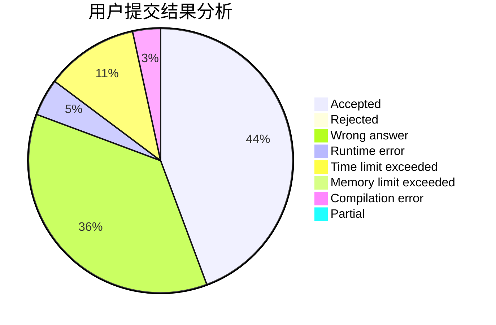
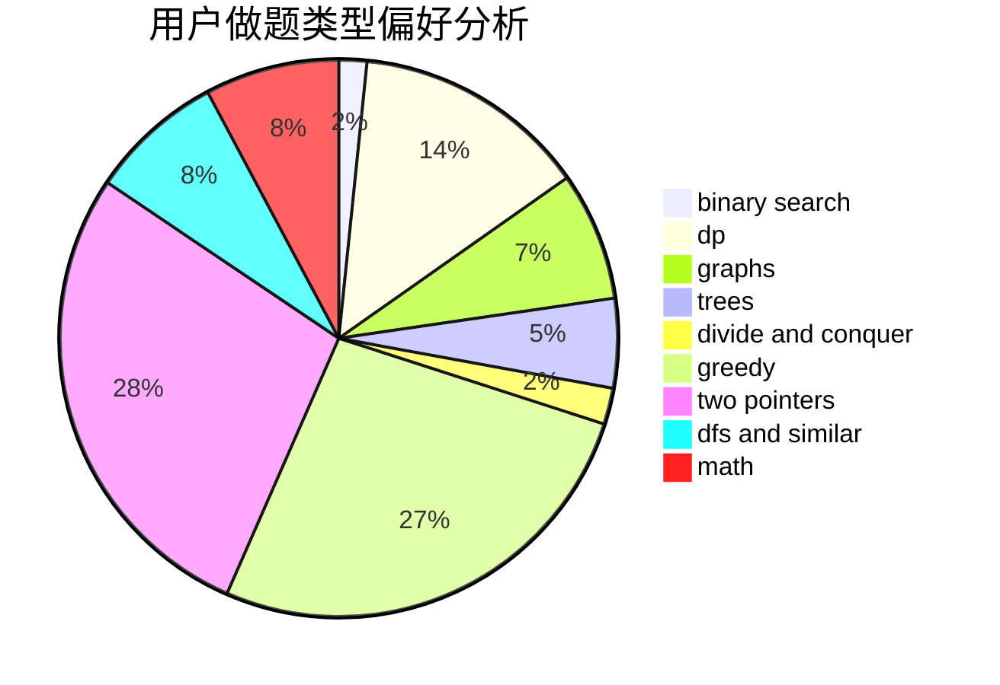

# windy7926778

<!-- tabs:start -->

#### **用户提交结果分析**

#### **用户做题类型偏好分析**

<!-- tabs:end -->
# 推荐题目
[412D](https://codeforces.com/contest/412/problem/D)
[870A](https://codeforces.com/contest/870/problem/A)
[543C](https://codeforces.com/contest/543/problem/C)
[567D](https://codeforces.com/contest/567/problem/D)
[754C](https://codeforces.com/contest/754/problem/C)
[989E](https://codeforces.com/contest/989/problem/E)
[1000C](https://codeforces.com/contest/1000/problem/C)
[1298E](https://codeforces.com/contest/1298/problem/E)
[48A](https://codeforces.com/contest/48/problem/A)
[538C](https://codeforces.com/contest/538/problem/C)
