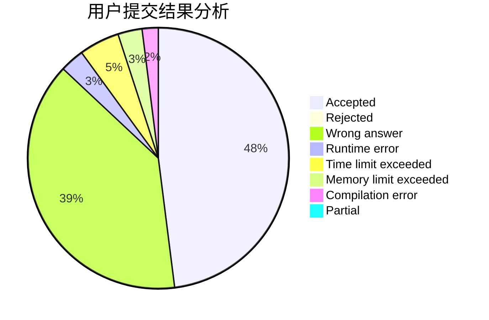
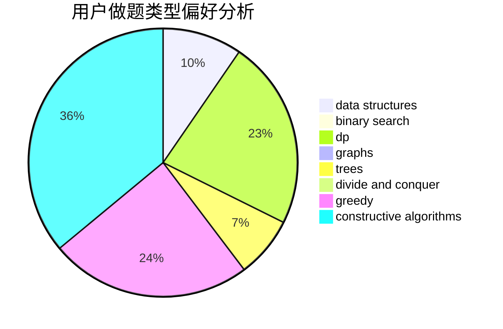
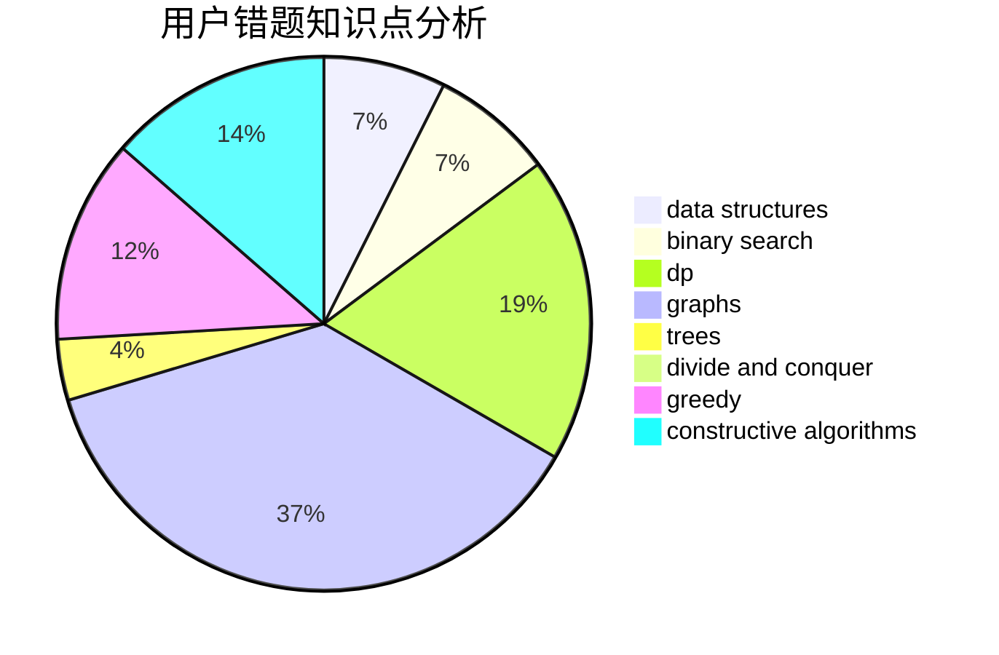

# wjxtrl

<!-- tabs:start -->

#### **用户提交结果分析**

#### **用户做题类型偏好分析**

#### **用户错题知识点分析**

<!-- tabs:end -->
# 推荐题目
[558D](https://codeforces.com/contest/558/problem/D)		data structures,
                        implementation,
                        sortings		  
[1089L](https://codeforces.com/contest/1089/problem/L)		nan		  
[727A](https://codeforces.com/contest/727/problem/A)		brute force,
                        dfs and similar,
                        math		  
[6E](https://codeforces.com/contest/6/problem/E)		binary search,
                        data structures,
                        dsu,
                        trees,
                        two pointers		  
[1113F](https://codeforces.com/contest/1113/problem/F)		dsu,graphs,sortings,trees		  
[1203F1](https://codeforces.com/contest/1203F/problem/1)		greedy		  
[1362E](https://codeforces.com/contest/1362/problem/E)		dsu,graphs,sortings,trees		  
[685B](https://codeforces.com/contest/685/problem/B)		data structures,
                        dfs and similar,
                        dp,
                        trees		  
[1322E](https://codeforces.com/contest/1322/problem/E)		data structures		  
[982C](https://codeforces.com/contest/982/problem/C)		dfs and similar,
                        dp,
                        graphs,
                        greedy,
                        trees		  
