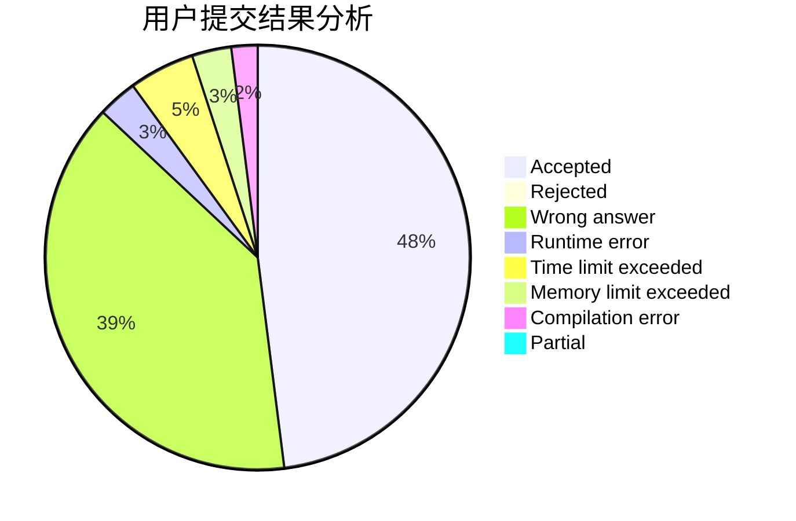
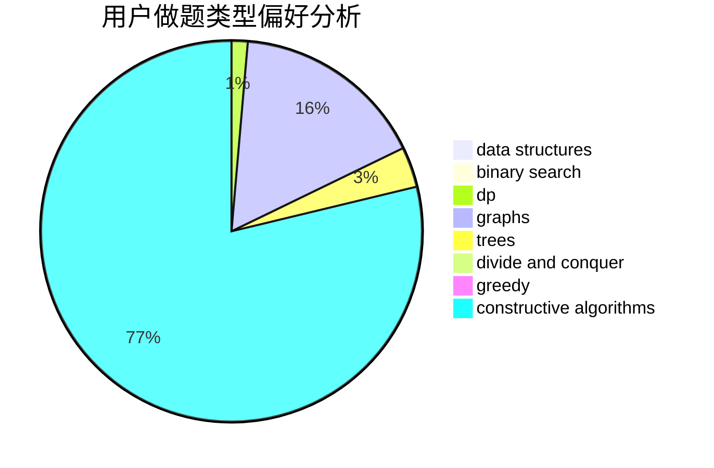
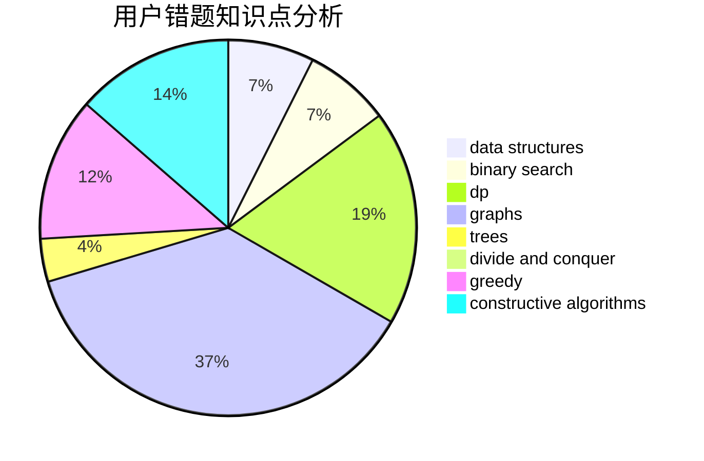

# wjxtrl

<!-- tabs:start -->

#### **用户提交结果分析**

#### **用户做题类型偏好分析**

#### **用户错题知识点分析**

<!-- tabs:end -->
# 推荐题目
[581B](https://codeforces.com/contest/581/problem/B)		implementation,
                        math		  
[1090A](https://codeforces.com/contest/1090/problem/A)		greedy		  
[744C](https://codeforces.com/contest/744/problem/C)		bitmasks,
                        brute force,
                        dp		  
[717I](https://codeforces.com/contest/717/problem/I)		geometry		  
[1114C](https://codeforces.com/contest/1114/problem/C)		brute force,
                        implementation,
                        math,
                        number theory		  
[1208D](https://codeforces.com/contest/1208/problem/D)		binary search,
                        data structures,
                        greedy,
                        implementation		  
[136D](https://codeforces.com/contest/136/problem/D)		dsu,graphs,sortings,trees		  
[707D](https://codeforces.com/contest/707/problem/D)		bitmasks,
                        data structures,
                        dfs and similar,
                        implementation		  
[1329D](https://codeforces.com/contest/1329/problem/D)		constructive algorithms,
                        data structures		  
[998A](https://codeforces.com/contest/998/problem/A)		constructive algorithms,
                        implementation		  
