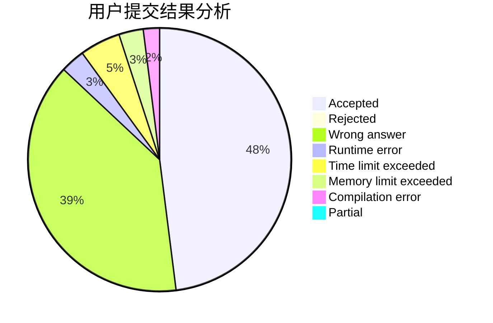
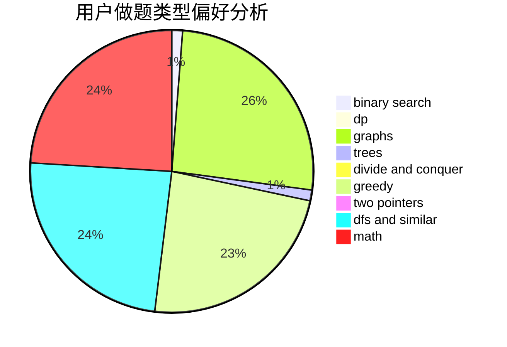

# wjxtrl

<!-- tabs:start -->

#### **用户提交结果分析**

#### **用户做题类型偏好分析**

<!-- tabs:end -->
# 推荐题目
[581B](https://codeforces.com/contest/581/problem/B)
[1090A](https://codeforces.com/contest/1090/problem/A)
[744C](https://codeforces.com/contest/744/problem/C)
[717I](https://codeforces.com/contest/717/problem/I)
[1114C](https://codeforces.com/contest/1114/problem/C)
[1208D](https://codeforces.com/contest/1208/problem/D)
[136D](https://codeforces.com/contest/136/problem/D)
[707D](https://codeforces.com/contest/707/problem/D)
[1329D](https://codeforces.com/contest/1329/problem/D)
[998A](https://codeforces.com/contest/998/problem/A)
