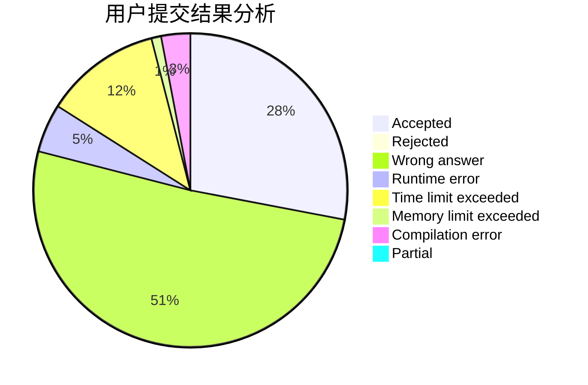
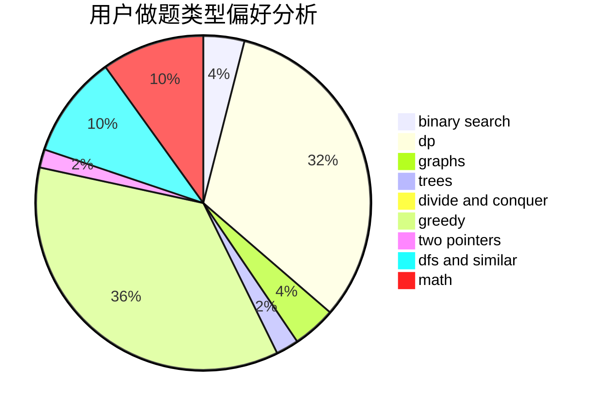

# wjyyy

<!-- tabs:start -->

#### **用户提交结果分析**

#### **用户做题类型偏好分析**

<!-- tabs:end -->
# 推荐题目
[853C](https://codeforces.com/contest/853/problem/C)
[371D](https://codeforces.com/contest/371/problem/D)
[295C](https://codeforces.com/contest/295/problem/C)
[525C](https://codeforces.com/contest/525/problem/C)
[750A](https://codeforces.com/contest/750/problem/A)
[507E](https://codeforces.com/contest/507/problem/E)
[12542](https://codeforces.com/contest/1254/problem/2)
[1234E](https://codeforces.com/contest/1234/problem/E)
[711C](https://codeforces.com/contest/711/problem/C)
[991A](https://codeforces.com/contest/991/problem/A)
