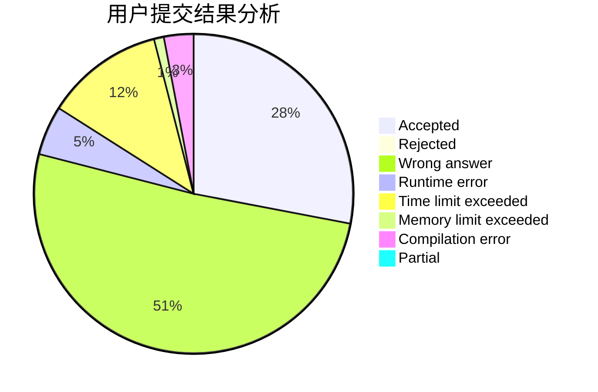
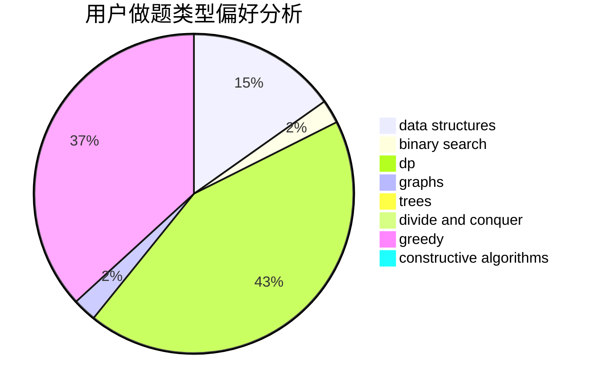
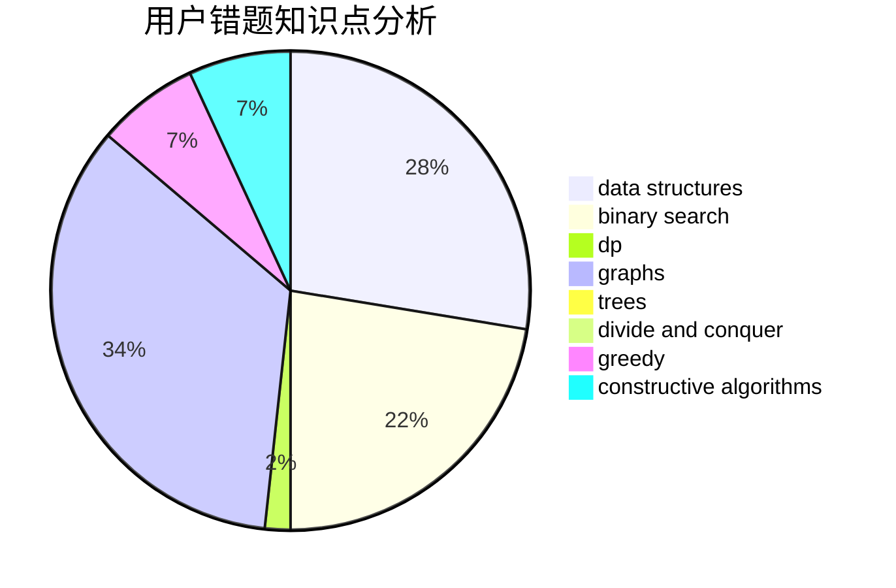

# wjyyy

<!-- tabs:start -->

#### **用户提交结果分析**

#### **用户做题类型偏好分析**

#### **用户错题知识点分析**

<!-- tabs:end -->
# 推荐题目
[853C](https://codeforces.com/contest/853/problem/C)		data structures		  
[371D](https://codeforces.com/contest/371/problem/D)		data structures,
                        dsu,
                        implementation,
                        trees		  
[295C](https://codeforces.com/contest/295/problem/C)		combinatorics,
                        dp,
                        graphs,
                        shortest paths		  
[525C](https://codeforces.com/contest/525/problem/C)		greedy,
                        math,
                        sortings		  
[750A](https://codeforces.com/contest/750/problem/A)		binary search,
                        brute force,
                        implementation,
                        math		  
[507E](https://codeforces.com/contest/507/problem/E)		dfs and similar,
                        dp,
                        graphs,
                        shortest paths		  
[12542](https://codeforces.com/contest/1254/problem/2)		dsu,graphs,sortings,trees		  
[1234E](https://codeforces.com/contest/1234/problem/E)		math		  
[711C](https://codeforces.com/contest/711/problem/C)		dp		  
[991A](https://codeforces.com/contest/991/problem/A)		implementation		  
