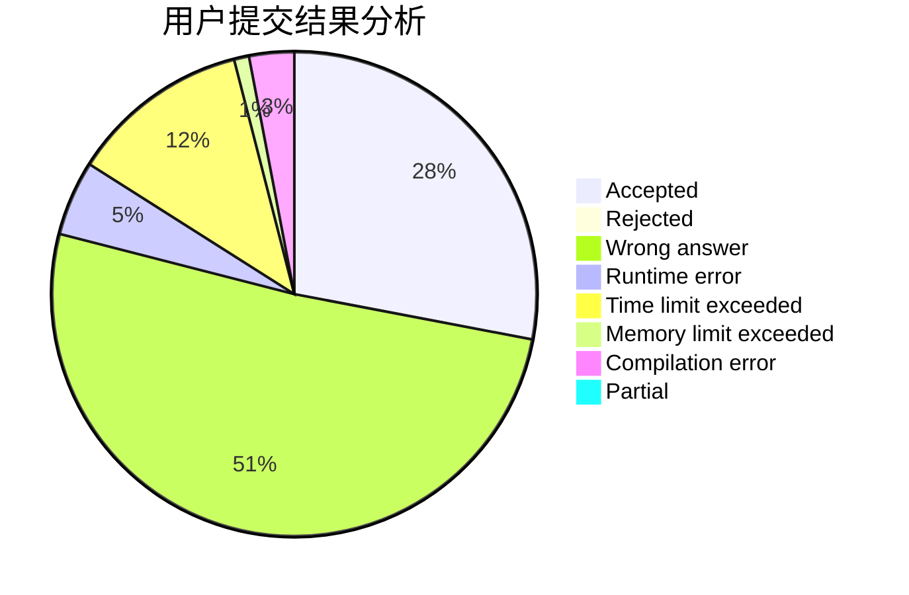
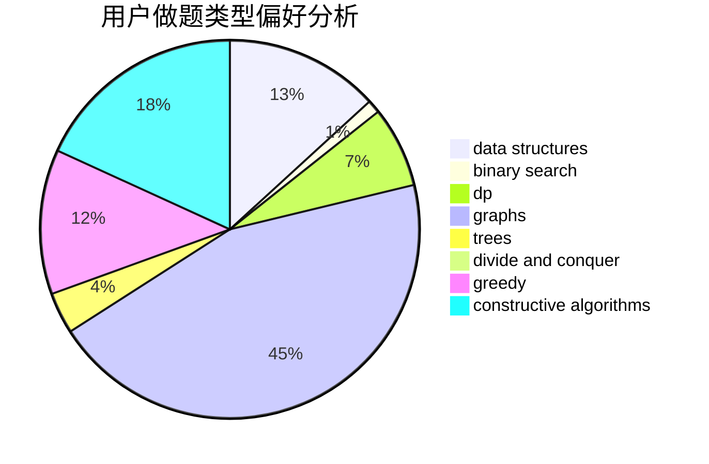
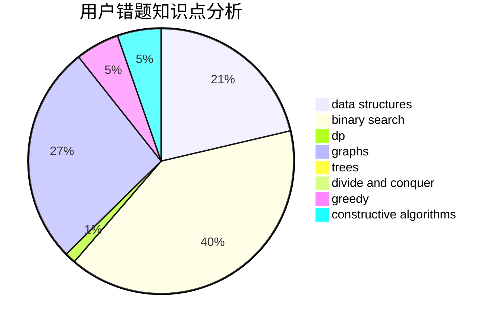

# wjyyy

<!-- tabs:start -->

#### **用户提交结果分析**

#### **用户做题类型偏好分析**

#### **用户错题知识点分析**

<!-- tabs:end -->
# 推荐题目
[835E](https://codeforces.com/contest/835/problem/E)		binary search,
                        constructive algorithms,
                        interactive		  
[346A](https://codeforces.com/contest/346/problem/A)		games,
                        math,
                        number theory		  
[27D](https://codeforces.com/contest/27/problem/D)		2-sat,
                        dfs and similar,
                        dsu,
                        graphs		  
[505A](https://codeforces.com/contest/505/problem/A)		brute force,
                        implementation,
                        strings		  
[732B](https://codeforces.com/contest/732/problem/B)		dp,
                        greedy		  
[486E](https://codeforces.com/contest/486/problem/E)		data structures,
                        dp,
                        greedy,
                        hashing,
                        math		  
[1250B](https://codeforces.com/contest/1250/problem/B)		brute force,
                        constructive algorithms,
                        greedy,
                        math		  
[1227A](https://codeforces.com/contest/1227/problem/A)		math		  
[691E](https://codeforces.com/contest/691/problem/E)		matrices		  
[977C](https://codeforces.com/contest/977/problem/C)		sortings		  
