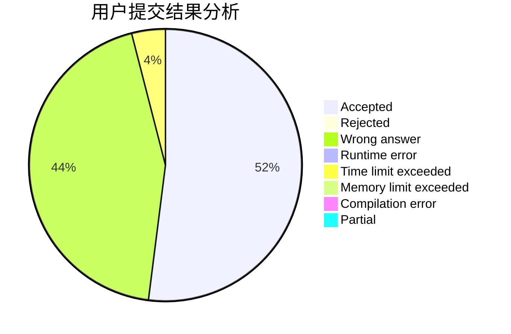
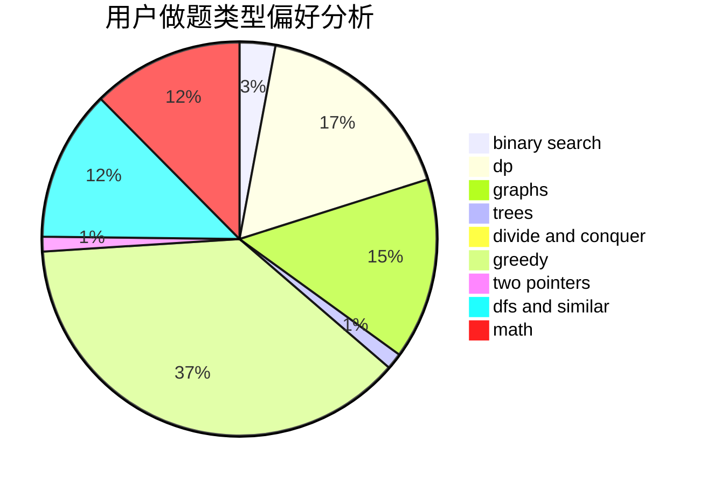

# 15629440225

<!-- tabs:start -->

#### **用户提交结果分析**

#### **用户做题类型偏好分析**

<!-- tabs:end -->
# 推荐题目
[1166F](https://codeforces.com/contest/1166/problem/F)
[1166D](https://codeforces.com/contest/1166/problem/D)
[1168E](https://codeforces.com/contest/1168/problem/E)
[1164M](https://codeforces.com/contest/1164/problem/M)
[1162E](https://codeforces.com/contest/1162/problem/E)
[1169B](https://codeforces.com/contest/1169/problem/B)
[1162D](https://codeforces.com/contest/1162/problem/D)
[1164P](https://codeforces.com/contest/1164/problem/P)
[1167E](https://codeforces.com/contest/1167/problem/E)
[1163D](https://codeforces.com/contest/1163/problem/D)
