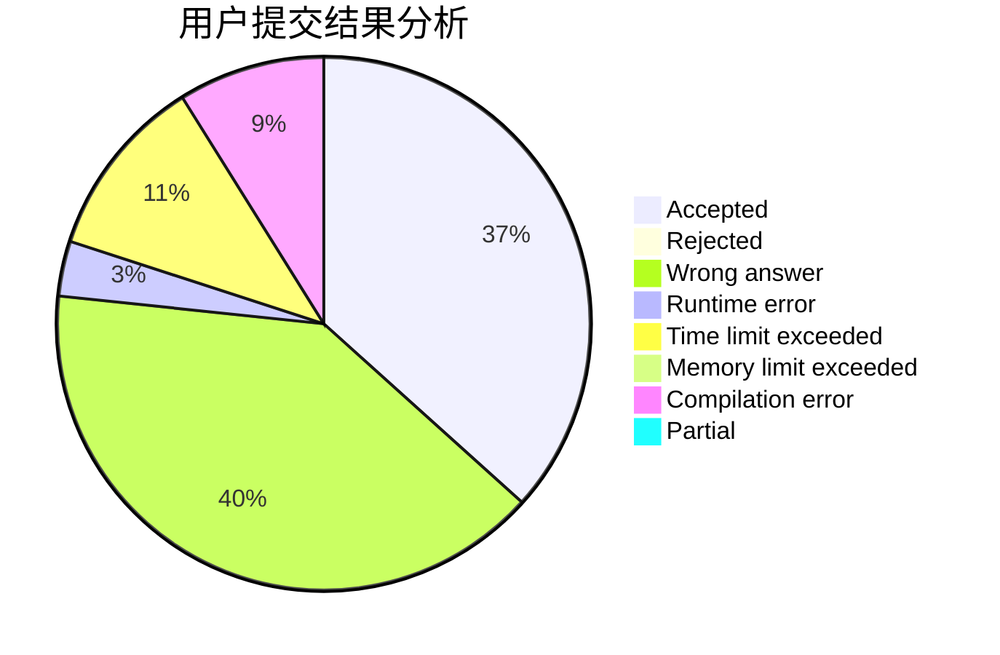
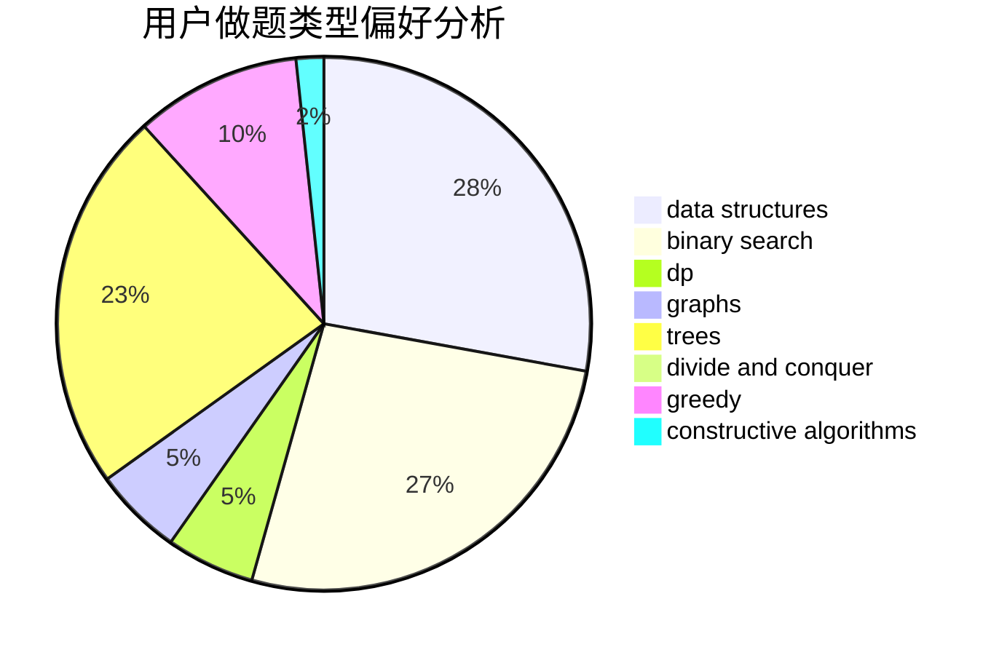
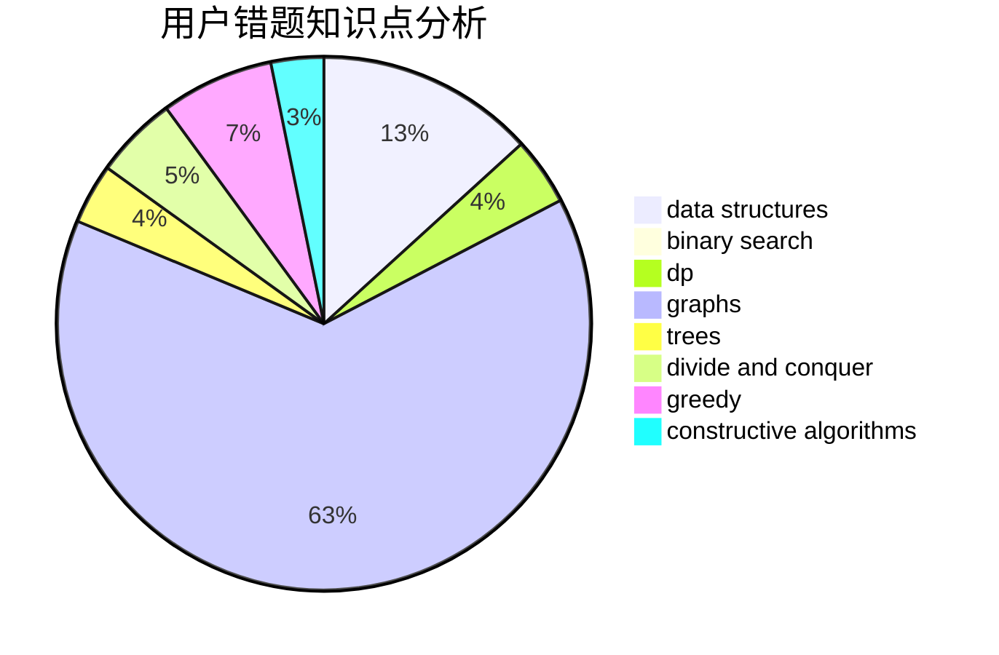

# Calvincheng1231

<!-- tabs:start -->

#### **用户提交结果分析**

#### **用户做题类型偏好分析**

#### **用户错题知识点分析**

<!-- tabs:end -->
# 推荐题目
[198B](https://codeforces.com/contest/198/problem/B)		shortest paths		  
[660E](https://codeforces.com/contest/660/problem/E)		combinatorics		  
[1513D](https://codeforces.com/contest/1513/problem/D)		constructive algorithms,
                        dsu,
                        graphs,
                        greedy,
                        number theory,
                        sortings		  
[1288E](https://codeforces.com/contest/1288/problem/E)		data structures		  
[11E](https://codeforces.com/contest/11/problem/E)		binary search,
                        dp,
                        greedy		  
[1101G](https://codeforces.com/contest/1101/problem/G)		math,
                        matrices		  
[660C](https://codeforces.com/contest/660/problem/C)		binary search,
                        dp,
                        two pointers		  
[660D](https://codeforces.com/contest/660/problem/D)		geometry		  
[1320E](https://codeforces.com/contest/1320/problem/E)		data structures,
                        dfs and similar,
                        dp,
                        shortest paths,
                        trees		  
[521E](https://codeforces.com/contest/521/problem/E)		dfs and similar,
                        graphs		  
