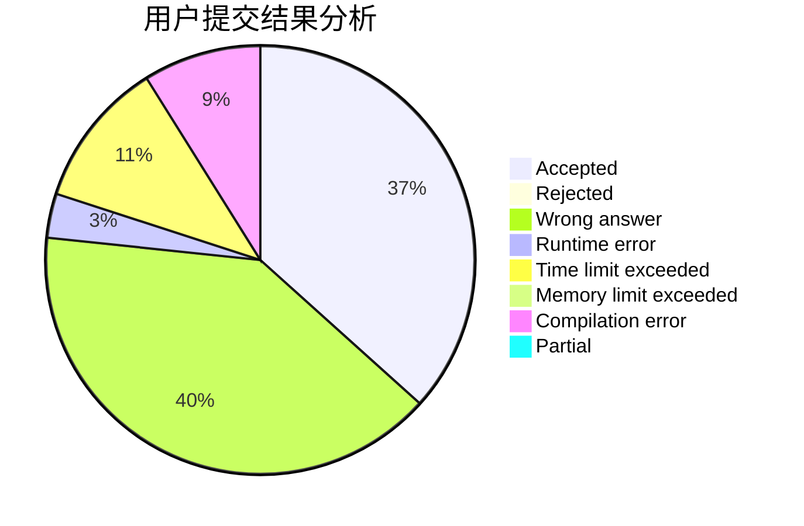
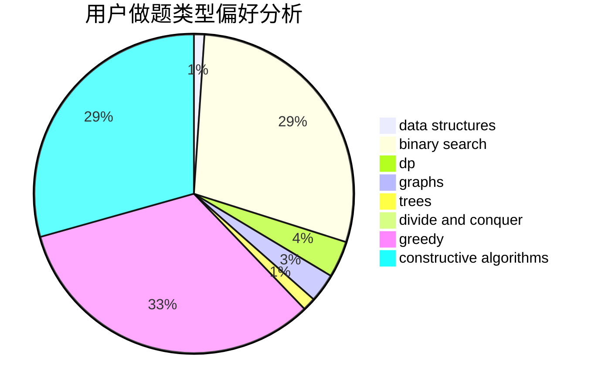
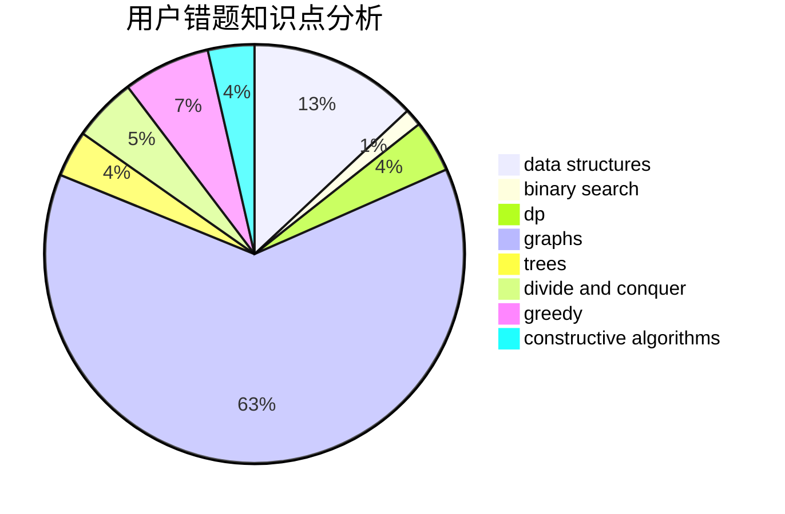

# Calvincheng1231

<!-- tabs:start -->

#### **用户提交结果分析**

#### **用户做题类型偏好分析**

#### **用户错题知识点分析**

<!-- tabs:end -->
# 推荐题目
[171B](https://codeforces.com/contest/171/problem/B)		*special problem,
                        combinatorics		  
[630J](https://codeforces.com/contest/630/problem/J)		math,
                        number theory		  
[1504E](https://codeforces.com/contest/1504/problem/E)		dsu,graphs,sortings,trees		  
[1282B2](https://codeforces.com/contest/1282B/problem/2)		dp,
                        greedy,
                        sortings		  
[1196D1](https://codeforces.com/contest/1196D/problem/1)		implementation		  
[1101D](https://codeforces.com/contest/1101/problem/D)		data structures,
                        dfs and similar,
                        dp,
                        number theory,
                        trees		  
[630G](https://codeforces.com/contest/630/problem/G)		combinatorics,
                        math		  
[630I](https://codeforces.com/contest/630/problem/I)		combinatorics,
                        math		  
[1311D](https://codeforces.com/contest/1311/problem/D)		brute force,
                        math		  
[500E](https://codeforces.com/contest/500/problem/E)		data structures,
                        dp,
                        dsu		  
